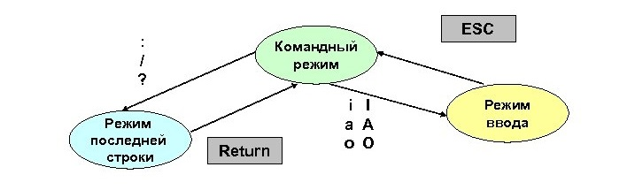

---
## Front matter
title: "Лабораторная работа №9"
subtitle: "Текстовый редактор vi"
author: "Гусева Светлана Алексеевна"

## Generic otions
lang: ru-RU
toc-title: "Содержание"

## Bibliography
bibliography: bib/cite.bib
csl: pandoc/csl/gost-r-7-0-5-2008-numeric.csl

## Pdf output format
toc: true # Table of contents
toc-depth: 2
lof: true # List of figures
lot: true # List of tables
fontsize: 12pt
linestretch: 1.5
papersize: a4
documentclass: scrreprt
## I18n polyglossia
polyglossia-lang:
  name: russian
  options:
	- spelling=modern
	- babelshorthands=true
polyglossia-otherlangs:
  name: english
## I18n babel
babel-lang: russian
babel-otherlangs: english
## Fonts
mainfont: PT Serif
romanfont: PT Serif
sansfont: PT Sans
monofont: PT Mono
mainfontoptions: Ligatures=TeX
romanfontoptions: Ligatures=TeX
sansfontoptions: Ligatures=TeX,Scale=MatchLowercase
monofontoptions: Scale=MatchLowercase,Scale=0.9
## Biblatex
biblatex: true
biblio-style: "gost-numeric"
biblatexoptions:
  - parentracker=true
  - backend=biber
  - hyperref=auto
  - language=auto
  - autolang=other*
  - citestyle=gost-numeric
## Pandoc-crossref LaTeX customization
figureTitle: "Рис."
tableTitle: "Таблица"
listingTitle: "Листинг"
lofTitle: "Список иллюстраций"
lotTitle: "Список таблиц"
lolTitle: "Листинги"
## Misc options
indent: true
header-includes:
  - \usepackage{indentfirst}
  - \usepackage{float} # keep figures where there are in the text
  - \floatplacement{figure}{H} # keep figures where there are in the text
---

# Цель работы

Познакомиться с операционной системой Linux. Получить практические навыки работы с редактором vi, установленным по умолчанию практически во всех дистрибутивах.

# Задание

Задание 1. Создание нового файла с использованием vi
1. Создайте каталог с именем ~/work/os/lab06.
2. Перейдите во вновь созданный каталог.
3. Вызовите vi и создайте файл hello.sh
vi hello.sh
4. Нажмите клавишу i и вводите следующий текст.
#!/bin/bash
HELL=Hello
function hello {
LOCAL HELLO=World
echo $HELLO
}
echo $HELLO
hello
5. Нажмите клавишу Esc для перехода в командный режим после завершения ввода
текста.
6. Нажмите : для перехода в режим последней строки и внизу вашего экрана
появится приглашение в виде двоеточия.
7. Нажмите w (записать) и q (выйти), а затем нажмите клавишу Enter для сохранения вашего текста и завершения работы.
8. Сделайте файл исполняемым
chmod +x hello.sh

Задание 2. Редактирование существующего файла
1. Вызовите vi на редактирование файла
vi ~/work/os/lab06/hello.sh
2. Установите курсор в конец слова HELL второй строки.
3. Перейдите в режим вставки и замените на HELLO. Нажмите Esc для возврата в
командный режим.
4. Установите курсор на четвертую строку и сотрите слово LOCAL.
5. Перейдите в режим вставки и наберите следующий текст: local, нажмите Esc
для возврата в командный режим.
6. Установите курсор на последней строке файла. Вставьте после неё строку, содержащую следующий текст: echo $HELLO.
7. Нажмите Esc для перехода в командный режим.
8. Удалите последнюю строку.
9. Введите команду отмены изменений u для отмены последней команды.
10. Введите символ : для перехода в режим последней строки. Запишите произведённые изменения и выйдите из vi.

# Теоретическое введение

Текстовым редактором (text editor) называют программу, которая предназначена для редактирования (составления и изменения) файлов, содержащих только текст, например: письмо, программа на языке C, системный конфигурационный файл. При том, что имеется много различных редакторов для системы Linux, единственный, чьё присутствие будет гарантировано в любой системе UNIX или Linux — это vi (visual editor).

Основные понятия

Редактор vi имеет три режима: командный режим (command mode), режим ввода (insert mode) и режим последней строки (last line mode).

При запуске редактора запускается командный режим. В этом режиме можно давать команды для редактирования файлов или перейти в другой режим. Например, при вводе x в командном режиме удаляется символ, на который указывает курсор. Клавиши-стрелки перемещают курсор по редактируемому файлу. Как правило, команды, используемые в командном режиме, состоят из одного или двух символов.

Основной ввод и редактирование текста осуществляется в режиме ввода. При использовании редактора vi основное время, скорее всего, будет проводиться именно в этом режиме. Переход в режим ввода из командного режима осуществляется командой i (от слова insert). Находясь в режиме ввода, можно вводить текст в то место, куда указывает курсор. Выход из режима ввода в командный режим осуществляется клавишей Esc.

Режим последней строки — это специальный режим, в котором редактору даются сложные команды. При вводе этих команд они отображаются в последней строке экрана (отсюда пошло название режима). Например, если ввести в командном режиме команду :, то осуществится переход в режим последней строки, и можно будет вводить такие команды, как wq (записать файл и покинуть редактор vi) или q! (выйти из редактора vi без сохранения изменений). В режиме последней строки обычно вводятся команды, название которых состоит из нескольких символов. В этом режиме в последнюю строку вводится команда, после чего нажимается клавиша Enter, и команда исполняется.

Чтобы открыть файл в vi, требуется выполнить в терминале команду:

vi filename 

где filename — имя файла, который требуется редактировать.

Колонка символов ~ в vi обозначает пустые строки, иначе говоря, указывает, что мы находимся в конце файла. Символ _ обозначает курсор.

Редактор vi сейчас находится в командном режиме. Чтобы перейти в режим ввода текста, требуется нажать клавишу i. Теперь можно ввести любое количество строк, после каждой нажимая клавишу Enter. Исправлять опечатки можно с помощью клавиши Backspace. Для выхода из режима ввода и возвращения в командный режим требуется нажать клавишу Esc.

Для выхода из редактора vi без сохранения изменений, сделанных в файле, используется команда :q!. Когда вводится команда :, курсор переходит на последнюю строку экрана, и таким образом редактор оказывается в режиме последней строки. В этом режиме возможно вводить некоторые расширенные команды. Одна из них — команда q!, которой завершается работа с редактором vi без сохранения сделанных изменений. Команда :wq сначала сохраняет файл со сделанными изменениями, а затем выходит из редактора vi. Команда ZZ (выданная в командном режиме, т. е. без введения команды :) эквивалентна команде :wq. Если файл со времени последней модификации не изменялся, то время создания файла также не будет изменено. Напомним, что в режиме последней строки введение команды завершается клавишей Enter.

Чтобы сохранить файл, но не выходить из редактора vi, используется команда :w.

Переключение между файлами

Для того, чтобы приступить к редактированию другого файла, используется команда :e. Например, чтобы прекратить редактирование файла test и вместо этого начать редактирование файла foo, надо ввести команду ":e foo_". 

Если команда :e будет введена без предварительного сохранения файла на диск, будет выдано сообщение об ошибке:

No write since last change (":edit!" overrides) 

Это сообщение означает, что после последней модификации файл не был сохранен, и редактор vi отказывается приступить к редактированию другого файла. В таком случае можно либо сохранить сделанные изменения командой :w и затем вводить команду :e, либо использовать команду ":e! foo_", где символ ! в последней команде сообщает редактору, что требуется приступить к редактированию другого файла, не сохраняя изменения в прежнем.

Включить в текущий файл содержимое другого файла можно командой :r. Например, команда ":r foo.txt" вставит содержимое файла foo.txt в текст начиная с текущего положения курсора.

Запуск команд оболочки

Из редактора vi можно выполнять команды оболочки. Команда :r! работает аналогично команде :r, но вместо содержимого другого файла она вставляет в редактируемый файл выдачу некоторой команды. Можно также «временно выйти» из редактора, запустить команду и затем вернуться обратно. Если используется команда ":shell", то редактор vi запускает сеанс командной оболочки, прерывая редактирование на время исполнения команд. Для выхода из оболочки и возвращения к редактированию надо ввести команду exit.

Как и в случае с любой программой в системе Linux, в первую очередь следует обратиться к экранной документации к программе vi. Следует знать также, что редактор vi является пользовательским интерфейсом редактора ex, который выполняет многие из команд режима последней строки редактора vi. Поэтому, в дополнение к сказанному выше, можно также читать экранную документацию к редактору ex. Обычно (кроме режимов восстановления после системных сбоев) доступна более современная и улучшенная версия vi — vim, который имеет аналогичный vi интерфейс, поддерживает все команды vi и кроме того — массу дополнительных возможностей. Подробное руководство по vim можно получить, запустив этот редактор и отдав команду :help.

# Выполнение лабораторной работы

Выполним первое задание лабораторной работы. Создадим каталог с именем ~/work/os/lab09. Вызовем vi и создадим файл hello.sh (рис. @fig:001).

{#fig:001 width=70%}

Нажмем клавишу i и введем текст из пункта 4 задания 2 (рис. @fig:002).

{#fig:002 width=70%}

Перейдем в командный режим после завершения ввода текста с помощью клавиши Esc. Сделаем файл исполняемым (рис. @fig:003). 

{#fig:003 width=70%}

Выполним второе задание лабораторной работы. Вызовем vi на редактирование файла (рис. @fig:004).

{#fig:004 width=70%}

Установим курсор в конец слова HELL второй строки (рис. @fig:005).

{#fig:005 width=70%}

Заменим слово HELL на HELLO. Вернемся в командный режим, установим курсор на четвертую строку и сотрем слово LOCAL. Перейдем в режим вставки, наберем текст local и вернемся в командный режим (рис. @fig:006).

{#fig:006 width=70%}

Установим курсор на последней строке файла. Вставим после нее строку, содержащую текст echo $HELLO (рис. @fig:007).

{#fig:007 width=70%}

Удалим последнюю строку. (рис. @fig:008).

{#fig:008 width=70%}

Введем команду отмены изменений u для отмены последней команды(рис. @fig:009).

{#fig:009 width=70%}

Перейдем в режим последней строки, запишем произведенные изменения и выйдем из vi.

# Ответы на контрольные вопросы

Контрольные вопросы
1. Дайте краткую характеристику режимам работы редактора vi.
Редактор vi имеет три режима работы:
– командный режим — предназначен для ввода команд редактирования и навигации по редактируемому файлу;
– режим вставки — предназначен для ввода содержания редактируемого файла;
– режим последней (или командной) строки — используется для записи изменений
в файл и выхода из редактора.
2. Как выйти из редактора, не сохраняя произведённые изменения?
Набрать символ q или q! 
3. Назовите и дайте краткую характеристику командам позиционирования.
– 0 (ноль) — переход в начало строки;
– $ — переход в конец строки;
– G — переход в конец файла;
– n G — переход на строку с номером n.
4. Что для редактора vi является словом?
Редактор vi предполагает, что слово - это строка символов, которая может включать в себя буквы, цифры и символы подчеркивания.
5. Каким образом из любого места редактируемого файла перейти в начало (конец)
файла?
Чтобы перейти в конец файла, требуется выполнить команду G. Чтобы перейти в начало файла, требуется выполнить команду gg.
6. Назовите и дайте краткую характеристику основным группам команд редактирования.
Вставка текста:
– а — вставить текст после курсора;
– А — вставить текст в конец строки;
– i — вставить текст перед курсором;
– n i — вставить текст n раз;
– I — вставить текст в начало строки.
Вставка строки:
– о — вставить строку под курсором;
– О — вставить строку над курсором.
Удаление текста:
– x — удалить один символ в буфер;
– d w — удалить одно слово в буфер;
– d $ — удалить в буфер текст от курсора до конца строки;
– d 0 — удалить в буфер текст от начала строки до позиции курсора;
– d d — удалить в буфер одну строку;
– n d d — удалить в буфер n строк.
Отмена и повтор произведённых изменений:
– u — отменить последнее изменение;
– . — повторить последнее изменение.
Копирование текста в буфер:
– Y — скопировать строку в буфер;
– n Y — скопировать n строк в буфер;
– y w — скопировать слово в буфер.
Вставка текста из буфера:
– p — вставить текст из буфера после курсора;
– P — вставить текст из буфера перед курсором.
Замена текста:
– c w — заменить слово;
– n c w — заменить n слов;
– c $ — заменить текст от курсора до конца строки;
– r — заменить слово;
– R — заменить текст.
Поиск текста:
– / текст — произвести поиск вперёд по тексту указанной строки символов
текст;
– ? текст — произвести поиск назад по тексту указанной строки символов
текст.
7. Необходимо заполнить строку символами $. Каковы ваши действия?
Перенести курсор в начало строки и заменить текст от курсора до конца строки при помощи команды c$.
8. Как отменить некорректное действие, связанное с процессом редактирования?
Использовать команду отмены последнего изменения u.
9. Назовите и дайте характеристику основным группам команд режима последней
строки.
Копирование и перемещение текста:
– : n,m d — удалить строки с n по m;
– : i,j m k — переместить строки с i по j, начиная со строки k;
– : i,j t k — копировать строки с i по j в строку k;
– : i,j w имя-файла — записать строки с i по j в файл с именем имя-файла.
Запись в файл и выход из редактора:
– : w — записать изменённый текст в файл, не выходя из vi;
– : w имя-файла — записать изменённый текст в новый файл с именем имя файла;
– : w ! имя-файла — записать изменённый текст в файл с именем имя файла;
– : w q — записать изменения в файл и выйти из vi;
– : q — выйти из редактора vi;
– : q ! — выйти из редактора без записи;
– : e ! — вернуться в командный режим, отменив все изменения, произведённые со времени последней записи.
Опции:
Опции редактора vi позволяют настроить рабочую среду. Для задания опций
используется команда set (в режиме последней строки):
– : set all — вывести полный список опций;
– : set nu — вывести номера строк;
– : set list — вывести невидимые символы;
– : set ic — не учитывать при поиске, является ли символ прописным или
строчным.
Если вы хотите отказаться от использования опции, то в команде set перед именем опции надо поставить no.
10. Как определить, не перемещая курсора, позицию, в которой заканчивается строка?
Перейти в конец строки при помощи команды $.
11. Выполните анализ опций редактора vi (сколько их, как узнать их назначение и
т.д.).
Рабочая среда редактора vi настраивается с помощью нескольких десятков опций, для задания которых используется команда set в режиме последней строки, например:

: set all - вывести полный список опций;

: set nu - вывести номера строк;

: set list - вывести невидимые символы;

: set ic - включить регистронезависимый поиск символов.

В командной строке vi допустимы следующие опции:

-t	Эквивалент первоначальной команды tag; редактирует файл, содержащий признак tag (тег), и устанавливает редактор согласно определению этого признака.
-r	Используется при восстановлении, когда имело место повреждение редактора или всей системы, отыскивает последнюю сохраненную версию указанного файла. Если файл не определен, то эта опция выводит список сохраненных файлов.
-l	Специфическая для редактирования LISP, эта опция устанавливает опции showmatch и lisp.
-Wn	По умолчанию устанавливает "окно" размером 'n'. Чрезвычайно удобно в наборных устройствах, чтобы начинать работу в малом окне.
-R	Устанавливает опцию "только чтение", при этом файлы могут только просматриваться, но не редактироваться.
12. Как определить режим работы редактора vi?
Сразу после запуска редактор находится в командном режиме, в котором можно перемещаться по тексту, выполнять копирование и вставку текста из буфера. Режим ввода включается по командам вставки, дополнения, замены. Нажатие Esc возвращает редактор в командный режим. Большинство команд выполняется сразу после нажатия клавиши. Исключение - команды, начинающиеся с двоеточия, которые выполняются после нажатия Enter.
13. Постройте граф взаимосвязи режимов работы редактора vi
(рис. @fig:010).

{#fig:010 width=70%}

# Выводы

# Список литературы{.unnumbered}

::: https://docs.altlinux.org/ru-RU/archive/2.3/html-single/junior/alt-docs-extras-linuxnovice/ch02s10.html
::: https://itmag.pro/unix/common/polnaya-reference-at-vi-redaktoru?ysclid=lh0zt8jjgi220573897
::: https://docs.altlinux.org/ru-RU/archive/2.3/html-single/junior/alt-docs-extras-linuxnovice/ch02s10.html
