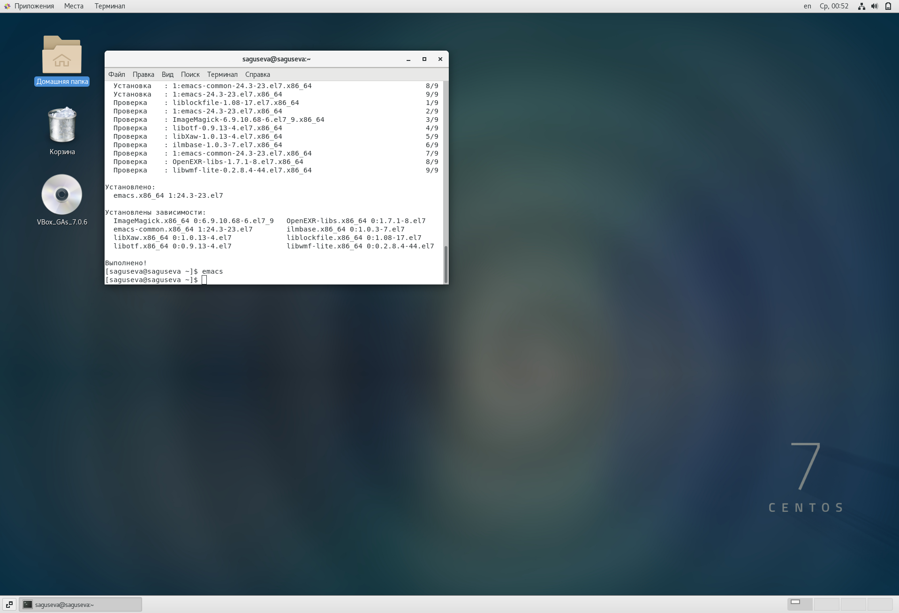
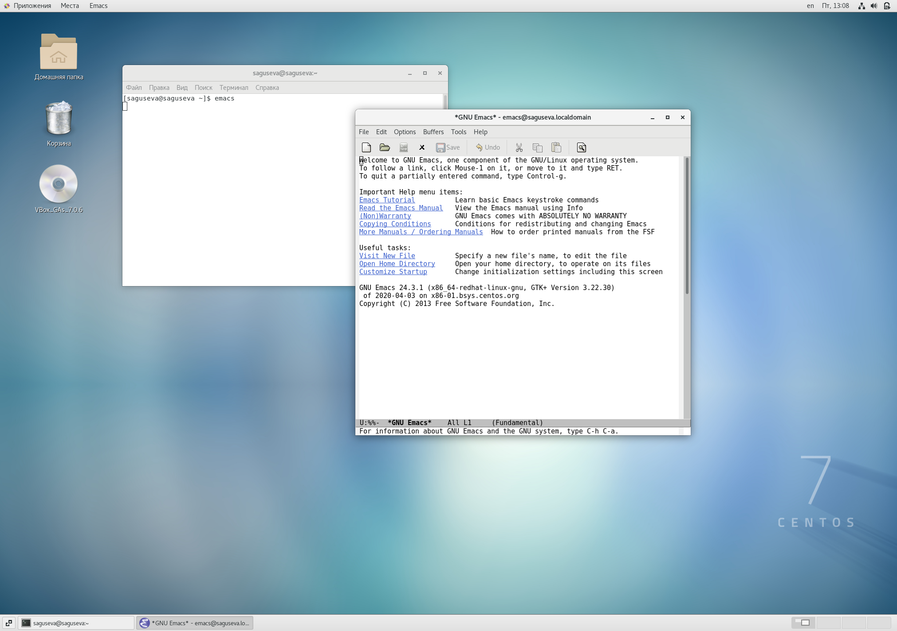
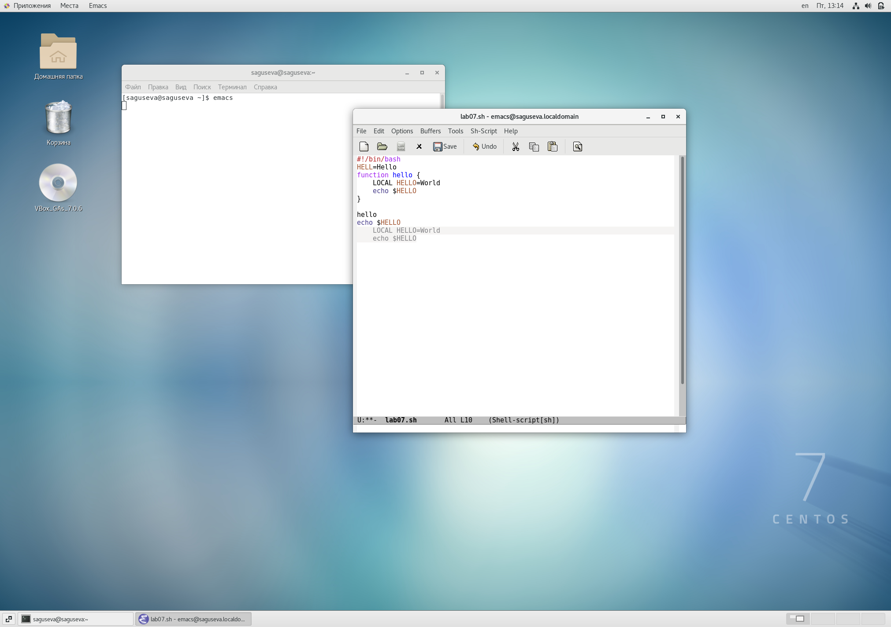
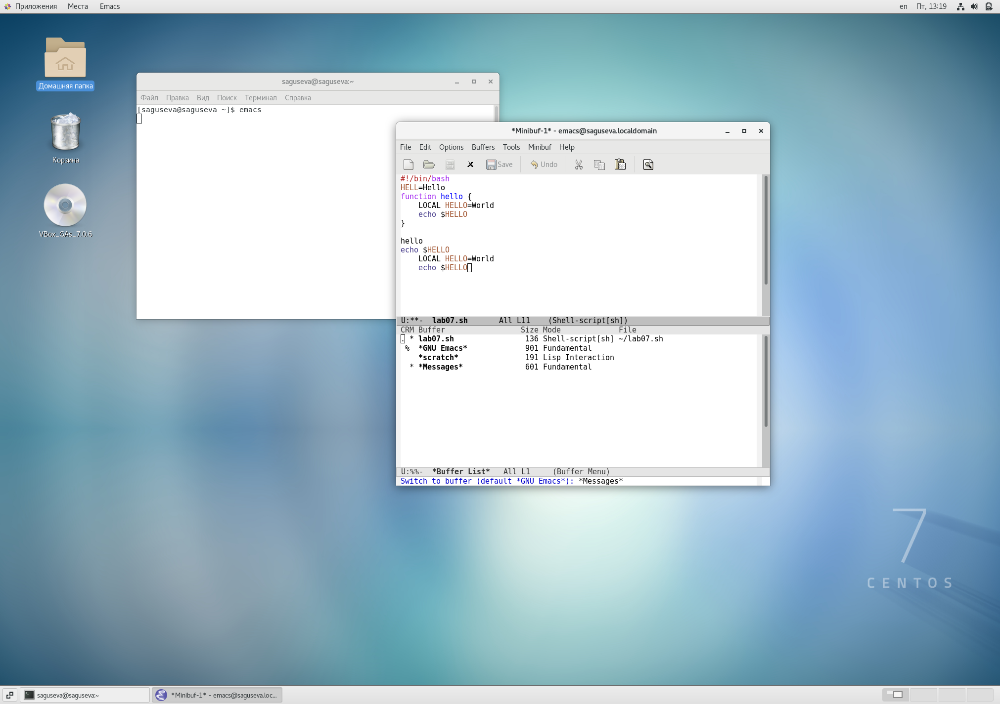
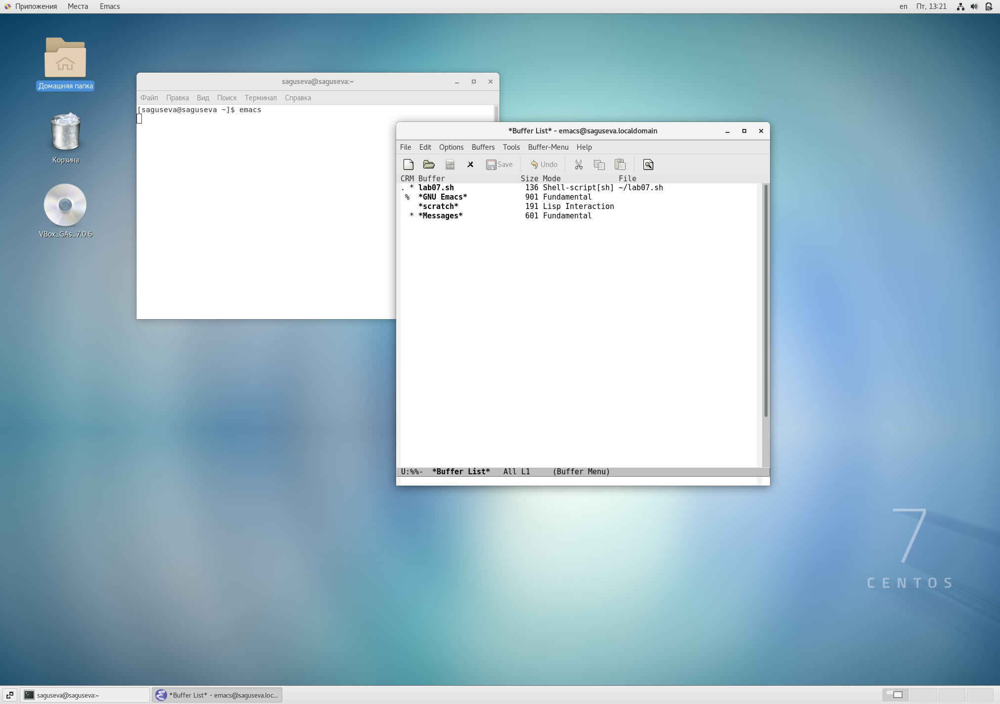
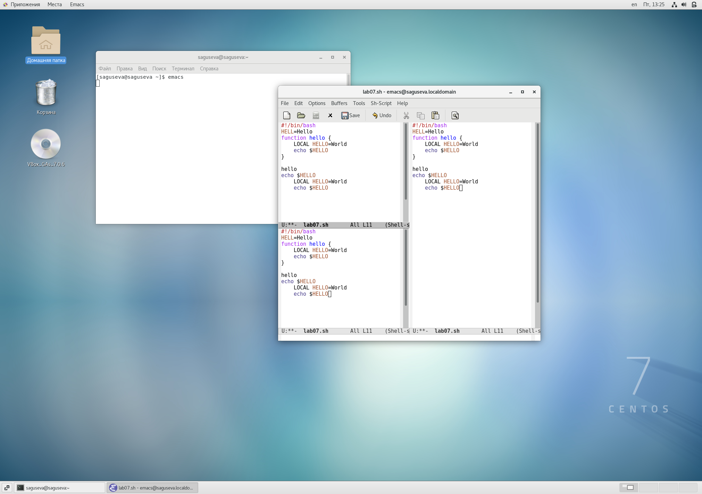
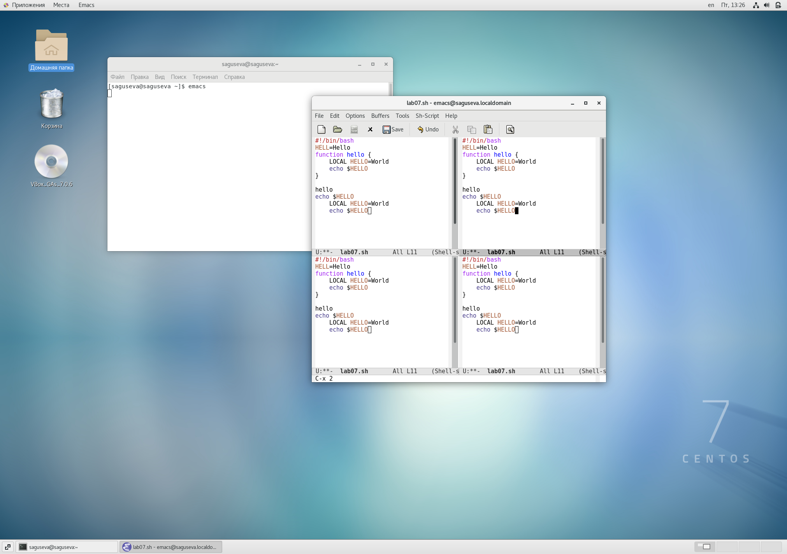
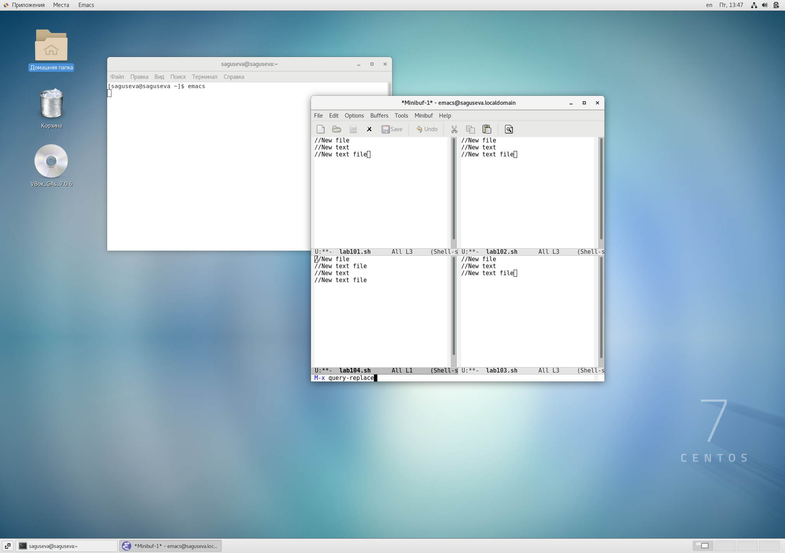

---
## Front matter
title: "Отчёт по лабораторной работе №10"
subtitle: "Операционные системы"
author: "Гусева Светлана Алексеевна"

## Generic otions
lang: ru-RU
toc-title: "Содержание"

## Bibliography
bibliography: bib/cite.bib
csl: pandoc/csl/gost-r-7-0-5-2008-numeric.csl

## Pdf output format
toc: true # Table of contents
toc-depth: 2
lof: true # List of figures
lot: true # List of tables
fontsize: 12pt
linestretch: 1.5
papersize: a4
documentclass: scrreprt
## I18n polyglossia
polyglossia-lang:
  name: russian
  options:
	- spelling=modern
	- babelshorthands=true
polyglossia-otherlangs:
  name: english
## I18n babel
babel-lang: russian
babel-otherlangs: english
## Fonts
mainfont: PT Serif
romanfont: PT Serif
sansfont: PT Sans
monofont: PT Mono
mainfontoptions: Ligatures=TeX
romanfontoptions: Ligatures=TeX
sansfontoptions: Ligatures=TeX,Scale=MatchLowercase
monofontoptions: Scale=MatchLowercase,Scale=0.9
## Biblatex
biblatex: true
biblio-style: "gost-numeric"
biblatexoptions:
  - parentracker=true
  - backend=biber
  - hyperref=auto
  - language=auto
  - autolang=other*
  - citestyle=gost-numeric
## Pandoc-crossref LaTeX customization
figureTitle: "Рис."
tableTitle: "Таблица"
listingTitle: "Листинг"
lofTitle: "Список иллюстраций"
lotTitle: "Список таблиц"
lolTitle: "Листинги"
## Misc options
indent: true
header-includes:
  - \usepackage{indentfirst}
  - \usepackage{float} # keep figures where there are in the text
  - \floatplacement{figure}{H} # keep figures where there are in the text
---

# Цель работы

Познакомиться с операционной системой Linux. Получить практические навыки работы с редактором Emacs.

# Задание

1. Открыть emacs.
2. Создать файл lab07.sh с помощью комбинации Ctrl-x Ctrl-f (C-x C-f).
3. Наберите текст:
#!/bin/bash
HELL=Hello
function hello {
    LOCAL HELLO=World
    echo $HELLO
}
echo $HELLO
hello
4. Сохранить файл с помощью комбинации Ctrl-x Ctrl-s (C-x C-s).
5. Проделать с текстом стандартные процедуры редактирования, каждое действие
должно осуществляться комбинацией клавиш.
5.1. Вырезать одной командой целую строку (С-k).
5.2. Вставить эту строку в конец файла (C-y).
5.3. Выделить область текста (C-space).
5.4. Скопировать область в буфер обмена (M-w).
5.5. Вставить область в конец файла.
5.6. Вновь выделить эту область и на этот раз вырезать её (C-w).
5.7. Отмените последнее действие (C-/).
6. Научитесь использовать команды по перемещению курсора.
6.1. Переместите курсор в начало строки (C-a).
6.2. Переместите курсор в конец строки (C-e).
6.3. Переместите курсор в начало буфера (M-<).
6.4. Переместите курсор в конец буфера (M->).
7. Управление буферами.
7.1. Вывести список активных буферов на экран (C-x C-b).
7.2. Переместитесь во вновь открытое окно (C-x) o со списком открытых буферов и переключитесь на другой буфер.
7.3. Закройте это окно (C-x 0).
7.4. Теперь вновь переключайтесь между буферами, но уже без вывода их списка
на экран (C-x b).
8. Управление окнами.
8.1. Поделите фрейм на 4 части: разделите фрейм на два окна по вертикали
(C-x 3), а затем каждое из этих окон на две части по горизонтали (C-x 2).
8.2. В каждом из четырёх созданных окон откройте новый буфер (файл) и введите несколько строк текста.
9. Режим поиска
9.1. Переключитесь в режим поиска (C-s) и найдите несколько слов, присутствующих в тексте.
9.2. Переключайтесь между результатами поиска, нажимая C-s.
9.3. Выйдите из режима поиска, нажав C-g.
9.4. Перейдите в режим поиска и замены (M-%), введите текст, который следует
найти и заменить, нажмите Enter , затем введите текст для замены. После того как будут подсвечены результаты поиска, нажмите ! для подтверждения
замены.
9.5. Испробуйте другой режим поиска, нажав M-s o. Объясните, чем он отличается от обычного режима?

# Теоретическое введение

Emacs — семейство многофункциональных расширяемых текстовых редакторов.
Оригинальный EMACS был написан в 1976 году Ричардом Столлманом и Гаем Стилом как набор макросов для редактирования (англ. Editor MACroS) для редактора TECO.
Основные термины Emacs:
Определение 1. Буфер — объект, представляющий какой-либо текст.
Буфер может содержать что угодно, например, результаты компиляции программы или встроенные подсказки. Практически всё взаимодействие с пользователем,
в том числе интерактивное, происходит посредством буферов.
Определение 2. Фрейм соответствует окну в обычном понимании этого слова. Каждый фрейм содержит область вывода и одно или несколько окон Emacs.
Определение 3. Окно — прямоугольная область фрейма, отображающая один из
буферов.
Каждое окно имеет свою строку состояния, в которой выводится следующая
информация: название буфера, его основной режим, изменялся ли текст буфера и
как далеко вниз по буферу расположен курсор. Каждый буфер находится только в
одном из возможных основных режимов. Существующие основные режимы включают режим Fundamental (наименее специализированный), режим Text, режим
Lisp, режим С, режим Texinfo и другие. Под второстепенными режимами понимается список режимов, которые включены в данный момент в буфере выбранного
окна.
Определение 4. Область вывода — одна или несколько строк внизу фрейма, в которой Emacs выводит различные сообщения, а также запрашивает подтверждения
и дополнительную информацию от пользователя.
Определение 5. Минибуфер используется для ввода дополнительной информации
и всегда отображается в области вывода.
Определение 6. Точка вставки — место вставки (удаления) данных в буфере.

Для запуска Emacs необходимо в командной строке набрать emacs (или emacs &
для работы в фоновом режиме относительно консоли).
Для работы с Emacs можно использовать как элементы меню, так и различные
сочетания клавиш. Например, для выхода из Emacs можно воспользоваться меню File и выбрать пункт Quit , а можно нажать последовательно Ctrl-x Ctrl-c (в обозначениях Emacs: C-x C-c).
Многие рутинные операции в Emacs удобнее производить с помощью клавиатуры, а не графического меню. Наиболее часто в командах Emacs используются
сочетания c клавишами Ctrl и Meta (в обозначениях Emacs: C- и M-; клавиша Shift
в Emasc обозначается как S-). Так как на клавиатуре для IBM PC совместимых ПК
клавиши Meta нет, то вместо неё можно использовать Alt или Esc . Для доступа к
системе меню используйте клавишу F10 .
Клавиши Ctrl , Meta и Shift принято называть префиксными. Например, запись
M-x означает, что надо удерживая клавишу Meta (или Alt ), нажать на клавишу x.
Для открытия файла следует использовать команду C-x C-f (надо, удерживая клавишу Ctrl , нажать на клавишу x , затем отпустить обе клавиши и снова, удерживая
клавишу Ctrl , нажать на клавишу f ).
По назначению префиксные сочетания клавиш различаются следующим образом:
– C-x — префикс ввода основных команд редактора (например, открытия, закрытии, сохранения файла и т.д.);
– C-c — префикс вызова функций, зависящих от используемого режима.
Определение 14. Режим — пакет расширений, изменяющий поведение буфера
Emacs при редактировании и просмотре текста (например, для редактирования исходного текста программ на языках С или Perl).
ри работе с командами Emacs можно использовать регулярные выражения. Основные отличия от PCRE (Perl Compatible Regular Expressions — библиотека регулярных выражений в стиле Perl):
– \s не задаёт пробел;
– \t не задаёт табуляцию;
– операция «или» и скобки группировки экранируются.

{#fig:001 width=70%}

# Выполнение лабораторной работы

Перед выполнением лабораторной работы была выполнена установка emacs с помощью команды sudo yum install emacs (рис. @fig:001).

{#fig:001 width=70%}
1. Открыть emacs (рис. @fig:002).

{#fig:002 width=70%}

2. Создать файл lab07.sh с помощью комбинации Ctrl-x Ctrl-f (C-x C-f) (рис. @fig:003, @fig004).

{#fig:003 width=70%}

{#fig:004 width=70%}

3. Наберите текст (рис. @fig005):
#!/bin/bash
HELL=Hello
function hello {
    LOCAL HELLO=World
    echo $HELLO
}
echo $HELLO
hello

{#fig:005 width=70%}

4. Сохранить файл с помощью комбинации Ctrl-x Ctrl-s (C-x C-s) (рис. @fig:006).

{#fig:006 width=70%}

5. Проделать с текстом стандартные процедуры редактирования, каждое действие
должно осуществляться комбинацией клавиш.
5.1. Вырезать одной командой целую строку (С-k) (рис. @fig:007).

{#fig:007 width=70%}

5.2. Вставить эту строку в конец файла (C-y) (рис. @fig:008).

{#fig:008 width=70%}

5.3. Выделить область текста (C-space) (рис. @fig:009).

{#fig:009 width=70%}

5.4. Скопировать область в буфер обмена (M-w).
5.5. Вставить область в конец файла (рис. @fig:010).

{#fig:010 width=70%}

5.6. Вновь выделить эту область и на этот раз вырезать её (C-w) (рис. @fig:011, @fig012).

{#fig:011 width=70%}

{#fig:012 width=70%}
5.7. Отмените последнее действие (C-/) (рис. @fig:013).

{#fig:013 width=70%}
6. Научитесь использовать команды по перемещению курсора.
6.1. Переместите курсор в начало строки (C-a) (рис. @fig:014).

{#fig:014 width=70%}

6.2. Переместите курсор в конец строки (C-e) (рис. @fig:015).

{#fig:015 width=70%}

6.3. Переместите курсор в начало буфера. Выполнено с помощью команды C-Home (рис. @fig:016).

{#fig:016 width=70%}

6.4. Переместите курсор в конец буфера. Выполнено с помощью команды C-End (рис. @fig:017).

{#fig:017 width=70%}

7. Управление буферами.
7.1. Вывести список активных буферов на экран (C-x C-b) (рис. @fig:018).

{#fig:018 width=70%}

7.2. Переместитесь во вновь открытое окно (C-x) o со списком открытых буферов и переключитесь на другой буфер (рис. @fig:019, @fig020, @fig021).

{#fig:019 width=70%}

{#fig:020 width=70%}

{#fig:021 width=70%}

7.3. Закройте это окно (C-x 0).

7.4. Теперь вновь переключайтесь между буферами, но уже без вывода их списка
на экран (C-x b) (рис. @fig:022, @fig023).

{#fig:022 width=70%}

{#fig:023 width=70%}

8. Управление окнами.
8.1. Поделите фрейм на 4 части: разделите фрейм на два окна по вертикали
(C-x 3), а затем каждое из этих окон на две части по горизонтали (C-x 2) (рис. @fig:024, @fig025, @fig026).

{#fig:024 width=70%}

{#fig:025 width=70%}

{#fig:026 width=70%}

8.2. В каждом из четырёх созданных окон откройте новый буфер (файл) и введите несколько строк текста (рис. @fig:022, @fig023).

{#fig:027 width=70%}

{#fig:028 width=70%}

9. Режим поиска
9.1. Переключитесь в режим поиска (C-s) и найдите несколько слов, присутствующих в тексте (рис. @fig:029, @fig030).

{#fig:029 width=70%}

{#fig:030 width=70%}

9.2. Переключайтесь между результатами поиска, нажимая C-s (рис. @fig:031).

{#fig:032 width=70%}

9.3. Выйдите из режима поиска, нажав C-g.
9.4. Перейдите в режим поиска и замены (выполнено с помощью команды M-x query-replace) (рис. @fig033), введите текст, который следует
найти и заменить(рис. @fig034), нажмите Enter, затем введите текст для замены (рис. @fig035). После того как будут подсвечены результаты поиска, нажмите ! для подтверждения
замены (рис. @fig:036). Результат замены (рис. @fig:037).

{#fig:033 width=70%}

{#fig:034 width=70%}

{#fig:035 width=70%}

{#fig:036 width=70%}

{#fig:037 width=70%}

9.5. Испробуйте другой режим поиска, нажав M-s o (рис. @fig:038, @fig:39). Объясните, чем он отличается от обычного режима? Отличается тем, что выполняет поиск по регулярным выражениям.

{#fig:038 width=70%}

{#fig:039 width=70%}

# Контрольные вопросы

1. Кратко охарактеризуйте редактор emacs.
Emacs представляет собой мощный экранный редактор текста, написанный на
языке высокого уровня Elisp. Основу идеологии Emacs составляют принципы «всё в одном», расширяемости, настраиваемости под пользователя и документированности. Функциональность Emacs можно разделить на три уровня: базовая, основной режим и дополнительные режимы. Сочетание этих трёх уровней позволяет выполнять огромное количество задач (в том числе и не связанных напрямую с редактированием текста) не выходя из редактора.
2. Какие особенности данного редактора могут сделать его сложным для освоения
новичком?
Использование команд клавиатуры для выполнения редактирования текстового файла.
3. Своими словами опишите, что такое буфер и окно в терминологии emacs’а.
Буфер - объект, в котором происходит редактирование текста, отображение текста, и т.д. Окно - прямоугольная область, в которой отображается буфер.
4. Можно ли открыть больше 10 буферов в одном окне?
Нет.
5. Какие буферы создаются по умолчанию при запуске emacs?
Scratch и Messages.
6. Какие клавиши вы нажмёте, чтобы ввести следующую комбинацию C-c | и
C-c C-|?
Ctrl+c Shift+\
Ctrl+c Ctrl+Shift+\
7. Как поделить текущее окно на две части?
По вертикали с помощью команды C-x 3, по горизонтали с помощью команды C-x 2.
8. В каком файле хранятся настройки редактора emacs?
В файле .emacs в домашней дирректории пользователя.
9. Какую функцию выполняет клавиша Backspace и можно ли её переназначить?
Функцию вызова help. Можно.
10. Какой редактор вам показался удобнее в работе vi или emacs? Поясните почему. Emacs, мне он показался более понятным интуитивно. В vi было неудобно переключаться между режимами.

# Выводы

В ходе выполнения лабораторной работы были получены практические навыки работы с редактором Emacs. Цель лабораторной работы достигнута.

# Список литературы{.unnumbered}

::: https://www.opennet.ru/docs/RUS/gnuemacs/emacs_20.html

https://ru.wikipedia.org/wiki/Emacs
:::
