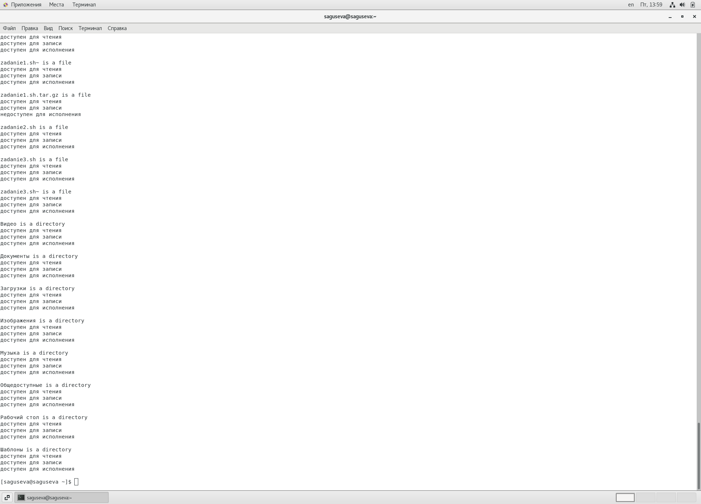

---
## Front matter
title: "Отчёт по лабораторной работе №11"
subtitle: "Операционные системы"
author: "Гусева Светлана Алексеевна"

## Generic otions
lang: ru-RU
toc-title: "Содержание"

## Bibliography
bibliography: bib/cite.bib
csl: pandoc/csl/gost-r-7-0-5-2008-numeric.csl

## Pdf output format
toc: true # Table of contents
toc-depth: 2
lof: true # List of figures
lot: true # List of tables
fontsize: 12pt
linestretch: 1.5
papersize: a4
documentclass: scrreprt
## I18n polyglossia
polyglossia-lang:
  name: russian
  options:
	- spelling=modern
	- babelshorthands=true
polyglossia-otherlangs:
  name: english
## I18n babel
babel-lang: russian
babel-otherlangs: english
## Fonts
mainfont: PT Serif
romanfont: PT Serif
sansfont: PT Sans
monofont: PT Mono
mainfontoptions: Ligatures=TeX
romanfontoptions: Ligatures=TeX
sansfontoptions: Ligatures=TeX,Scale=MatchLowercase
monofontoptions: Scale=MatchLowercase,Scale=0.9
## Biblatex
biblatex: true
biblio-style: "gost-numeric"
biblatexoptions:
  - parentracker=true
  - backend=biber
  - hyperref=auto
  - language=auto
  - autolang=other*
  - citestyle=gost-numeric
## Pandoc-crossref LaTeX customization
figureTitle: "Рис."
tableTitle: "Таблица"
listingTitle: "Листинг"
lofTitle: "Список иллюстраций"
lotTitle: "Список таблиц"
lolTitle: "Листинги"
## Misc options
indent: true
header-includes:
  - \usepackage{indentfirst}
  - \usepackage{float} # keep figures where there are in the text
  - \floatplacement{figure}{H} # keep figures where there are in the text
---

# Цель работы

Изучить основы программирования в оболочке ОС UNIX/Linux. Научиться писать небольшие командные файлы.

# Задание

1. Написать скрипт, который при запуске будет делать резервную копию самого себя (то есть файла, в котором содержится его исходный код) в другую директорию
backup в вашем домашнем каталоге. При этом файл должен архивироваться одним из архиваторов на выбор zip, bzip2 или tar. Способ использования команд
архивации необходимо узнать, изучив справку.
2. Написать пример командного файла, обрабатывающего любое произвольное
число аргументов командной строки, в том числе превышающее десять. Например, скрипт может последовательно распечатывать значения всех переданных
аргументов.
3. Написать командный файл — аналог команды ls (без использования самой этой
команды и команды dir). Требуется, чтобы он выдавал информацию о нужном
каталоге и выводил информацию о возможностях доступа к файлам этого каталога.
4. Написать командный файл, который получает в качестве аргумента командной
строки формат файла (.txt, .doc, .jpg, .pdf и т.д.) и вычисляет количество
таких файлов в указанной директории. Путь к директории также передаётся в
виде аргумента командной строки.

<<<<<<< HEAD
=======

# Теоретическое введение

Командная оболочка Bash является одним из нескольких главных компонентов в дистрибутивах Linux. Она позволяет читать и запускать команды, выполнять скрипты, работать с файлами. Наличие Bash не менее важно для полноценного функционирования операционных систем семейства Linux, чем ядро или рабочее окружение.

Bash (Bourne again shell или «возрождённый» shell) – это модифицированная версия программной оболочки Bourne-shell (sh или «Оболочка Борна»). Она является командным процессором, работающим интерактивно в текстовом окне. Bash нужен для приема команд пользователя и их отправки операционной системе для последующей обработки.

Bash – это универсальный инструмент для выполнения различных задач, который в некоторых случаях позволяет избежать установки специализированного программного обеспечения. Одновременно, это скриптовый язык программирования, позволяющий создавать сценарии для автоматизации различных операций.

Предшественница Bash  –  Bourne-shell (sh, «Оболочка Борна») была одной из первых оболочек для операционных систем Unix. Ее создал в 1978 году британский ученый Стивен Борн, давший Bourne-shell свое имя.

Изначально оболочка sh обладала относительно небольшим набором функций. Но в 1987 году Bourne-shell заинтересовался программист Брайан Фокс, сумевший доработать и значительно расширить ее функционал. В 1989 году Брайан создал бета-версию Bash и продолжал поддерживать свое детище вплоть до 1993 года.

Основные команды, правила их написания и прочие особенности Bash были перенесены из sh. Прочие возможности, включая историю, позаимствованы из Korn Shell и C Shell (других вариаций Bourne-shell). Bash практически полностью соответствует стандартам POSIX.

Сегодня оболочка Bash предустановлена в большей части дистрибутивов Unix/Linux. Взаимодействие оболочки и операционной системы обеспечивается с помощью специальной программы – терминала (например, lxterm, xterm, eterm, gnome-terminal).

Правила написания Bash представляют собой расширенный синтаксис Bourne-shell.

Bash в Linux способна выполнять практически все важные сценарии Bourne-shell без внесения дополнительных изменений. Исключение составляют те, где необходимо ссылаться на спецпеременные Bourne-shell или, где применяются ее встроенные команды.

В синтаксисе Bash применяются приемы из Korn Shell и C Shell:

-редактирование командной строки;

-вывод истории команд;

-создание стеков директорий;

-правила замены команд «$(…)»;

-переменные «$PPID» и «$RANDOM».

Используя консоль Bash в качестве интерактивного интерпретатора, можно прибегать к автодополнению названий файлов, программ, переменных и команд нажатием клавиши Tab.

На данный момент разработано множество различных вариаций Bourne-Shell. Но, по сравнению с ними, командный интерпретатор Bash обладает рядом преимуществ.

-Позволяет работать со структурами «\[\[» (в sh доступна только «\[» с ограничениями).

-Поддерживает работу с массивами в Линуксе.

-Доступно множество расширений, выполненных по стандартам C, включая циклы с тремя аргументами «for((i=0;i<=3;i++))», возможность присваивать инкремент «+=» и многое другое.

-Поддерживает синтаксис «<<<‘here strings’».

-Работает с расширениями «.{png,jpg}».

-Доступны алиасы для перенаправления, подобно «Csh», подобно «&|» для «2>&1 |» и «&>» для «> … 2>&1».

-Поддерживает сопроцессы с перенаправлением «<>».

-Огромный комплект расширений нестандартных конфигураций, включая изменение регистра.

-Существенно увеличены возможности арифметики (правда, нет поддержки чисел с плавающей точкой).

-Переменные «$RANDOM», «$SECONDS», «$PIPESTATUS[\@]» и «$FUNCNAME» в Bash являются расширениями.

-Доступно огромное количества функций, обеспечивающих работу в интерактивном режиме. Хотя на поведение скриптов они не влияют.

Примеры применения:

-Вывести указанное количество строчек из лога.

-Найти и составить выборку ключевых слов, сохранив их в новом файле.

-Очистить экран терминала.

-Приостановить работающие задачи и перезапустить ранее приостановленные.

-Создать архив директории с файлами и отправить его на другой компьютер в одной сети через определенный сетевой протокол.

-Произвести настройку системы создания резервных копий файлов баз данных, используя дампинг.

-Послать запрос о конфигурации других компьютеров в сети. Отправить файл с собранной информацией на электронную почту.

-Найти на диске дублированные файлы, отобразить их список и выполнить запрос их удалить.

-Рекурсивно заменить владельцев указанных файлов и папок.

Помимо вышеперечисленного, интерпретатор имеет множество полезных встроенных команд. С их помощью можно выполнять весь спектр работы с веб-сервером. Часть этих команд используется для работы со строками и массивами текстовых данных в консольном окружении ОС семейства Unix.

>>>>>>> 347621cbb229fe5c58ef015f9e54dc3e5ab2d38b
# Выполнение лабораторной работы

1. Написать скрипт, который при запуске будет делать резервную копию самого себя (то есть файла, в котором содержится его исходный код) в другую директорию
backup в вашем домашнем каталоге. При этом файл должен архивироваться одним из архиваторов на выбор zip, bzip2 или tar. Способ использования команд
архивации необходимо узнать, изучив справку.

Создание папки backup (рис. @fig:001).

{#fig:001 width=70%}

Скрипт и результат выполнения задания 1 (рис. @fig:002).

{#fig:002 width=70%}

2. Написать пример командного файла, обрабатывающего любое произвольное
число аргументов командной строки, в том числе превышающее десять. Например, скрипт может последовательно распечатывать значения всех переданных
аргументов. Скрипт и результат выполнения задания 2 (рис. @fig:003).

{#fig:003 width=70%}

3. Написать командный файл — аналог команды ls (без использования самой этой
команды и команды dir). Требуется, чтобы он выдавал информацию о нужном
каталоге и выводил информацию о возможностях доступа к файлам этого каталога. (рис. @fig:004). Скрипт выполнения задания 3 (рис. @fig:004), результат выполнения (рис. @fig:005, @fig:006, @fig:007).

{#fig:004 width=70%}

{#fig:005 width=70%}

{#fig:006 width=70%}

{#fig:007 width=70%}

4. Написать командный файл, который получает в качестве аргумента командной
строки формат файла (.txt, .doc, .jpg, .pdf и т.д.) и вычисляет количество
таких файлов в указанной директории. Путь к директории также передаётся в
виде аргумента командной строки. Скрипт и результат выполнения задания 4 (рис. @fig:008).

{#fig:008 width=70%}

# Контрольные вопросы

1. Объясните понятие командной оболочки. Приведите примеры командных оболочек. Чем они отличаются?
Командная оболочка — программа, через которую пользователь или администратор управляет операционной системой и установленными программами, используя командную строку.
Примеры и отличия командных оболочек:  
– оболочка Борна (Bourne shell или sh) — стандартная командная оболочка
UNIX/Linux, содержащая базовый, но при этом полный набор функций;
– С-оболочка (или csh) — надстройка на оболочкой Борна, использующая Сподобный синтаксис команд с возможностью сохранения истории выполнения
команд;
– оболочка Корна (или ksh) — напоминает оболочку С, но операторы управления
программой совместимы с операторами оболочки Борна;
– BASH — сокращение от Bourne Again Shell (опять оболочка Борна), в основе своей совмещает свойства оболочек С и Корна (разработка компании Free Software
Foundation).
2. Что такое POSIX?
POSIX (Portable Operating System Interface for Computer Environments) — набор
стандартов описания интерфейсов взаимодействия операционной системы и прикладных программ.
3. Как определяются переменные и массивы в языке программирования bash?
Значениями переменной могут быть число, строка или отдельные символы. Пример определения переменной:
```path="$HOME"```
Чтение переменной:
```"${path}"```
Пример определения массива:
a=(1 2 3 4 5)
В массивах можно хранить числа и строки одновременно, например:
```b=(1 2 "three" 4 "five")```
Обращение к элементу массива с номером i:
${a[\$i]}
Чтобы вывести все элементы массива, требуется использовать символ @:
${a[@]}
4. Каково назначение операторов let и read?
Let — это встроенная функция bash, которая позволяет производить базовые арифметические операции. Read — это встроенная команда bash, которая считывает строку из стандартного ввода (или из файлового дескриптора) и разбивает строку на слова.
5. Какие арифметические операции можно применять в языке программирования
bash?
Сложение, вычитание, умножение, деление, возведение в степень, остаток от деления.
6. Что означает операция (( ))?
Внутри двойных скобок записываются арифметические действия или условия.
7. Какие стандартные имена переменных Вам известны?
HOME — имя домашнего каталога пользователя. Если команда cd вводится без
аргументов, то происходит переход в каталог, указанный в этой переменной.
IFS — последовательность символов, являющихся разделителями в командной
строке, например, пробел, табуляция и перевод строки (new line).
MAIL — командный процессор каждый раз перед выводом на экран промптера
проверяет содержимое файла, имя которого указано в этой переменной, и если
содержимое этого файла изменилось с момента последнего ввода из него, то перед тем как вывести на терминал промптер, командный процессор выводит на
терминал сообщение You have mail (у Вас есть почта).
TERM — тип используемого терминала.
LOGNAME — содержит регистрационное имя пользователя, которое устанавливается автоматически при входе в систему.
8. Что такое метасимволы?
Символы, которые имеют особое назначение. Например, *   соответствует произвольной, в том числе и пустой строке.
9. Как экранировать метасимволы?
Экранирование может быть осуществлено с помощью предшествующего метасимволу символа \, который, в
свою очередь, является метасимволом.
10. Как создавать и запускать командные файлы?
Последовательность команд может быть помещена в текстовый файл. Такой
файл называется командным. Далее этот файл можно выполнить по команде:
bash командный_файл [аргументы]
Чтобы не вводить каждый раз последовательности символов bash, необходимо
изменить код защиты этого командного файла, обеспечив доступ к этому файлу по
выполнению. Это может быть сделано с помощью команды
chmod +x имя_файла
Теперь можно вызывать свой командный файл на выполнение, просто вводя его
имя с терминала.
11. Как определяются функции в языке программирования bash?
Функция определяется с помощью ключевого слова function, после которого следует имя функции и список команд, заключённых в фигурные скобки.
12. Каким образом можно выяснить, является файл каталогом или обычным файлом?
Если выражение
```-d "$file"```
истино, то файл является каталогом. Если выражение 
```-f "$file"```
истино, то файл является файлом.
13. Каково назначение команд set, typeset и unset?
Set — это встроенная команда оболочки, которая позволяет отображать или устанавливать переменные оболочки и среды.
Typeset имеет четыре опции для работы с функциями:
– -f — перечисляет определённые на текущий момент функции;
– -ft — при последующем вызове функции инициирует её трассировку;
– -fx — экспортирует все перечисленные функции в любые дочерние программы
оболочек;
– -fu — обозначает указанные функции как автоматически загружаемые. Автоматически загружаемые функции хранятся в командных файлах, а при их вызове
оболочка просматривает переменную FPATH, отыскивая файл с одноимёнными
именами функций, загружает его и вызывает эти функции.
Unset удаляет переменную по имени до конца текущей сессии. Удалить функцию можно с помощью команды unset c флагом -f.
14. Как передаются параметры в командные файлы?
При вызове командного файла через пробел. В тексте командного файла первый из них мы обозначается записью $1, второй записью $2, третий записью $3 и т.д. до $9.
15. Назовите специальные переменные языка bash и их назначение.
$* — отображается вся командная строка или параметры оболочки;
$? — код завершения последней выполненной команды;
$$ — уникальный идентификатор процесса, в рамках которого выполняется командный процессор;
$! — номер процесса, в рамках которого выполняется последняя вызванная на
выполнение в командном режиме команда;
$- — значение флагов командного процессора;
$\{#*\} — возвращает целое число — количество слов, которые были результатом
$*;
$\{#name\} — возвращает целое значение длины строки в переменной name;
$\{name[n]\} — обращение к n-му элементу массива;
$\{name[*]\} — перечисляет все элементы массива, разделённые пробелом;
$\{name[@]\} — то же самое, но позволяет учитывать символы пробелы в самих
переменных;
$\{name:-value\} — если значение переменной name не определено, то оно будет
заменено на указанное value;
$\{name:value\} — проверяется факт существования переменной;
$\{name=value\} — если name не определено, то ему присваивается значение
value;
$\{name?value\} — останавливает выполнение, если имя переменной не определено, и выводит value как сообщение об ошибке;
$\{name+value\} — это выражение работает противоположно ${name-value}.
Если переменная определена, то подставляется value;
$\{name#pattern\} — представляет значение переменной name с удалённым самым коротким левым образцом (pattern);
$\{#name[*]\} и $\{#name[@]\} — эти выражения возвращают количество элементов в массиве name.

# Выводы

В процессе выполнения мной были изучены основы программирования в оболочке ОС UNIX/Linux и получены навыки написания небольших командных файлов.

# Список литературы{.unnumbered}

::: {https://habr.com
https://bestprogrammer.ru/izuchenie/komanda-set-linux?ysclid=lhklmm0xlv908627071
}
:::
