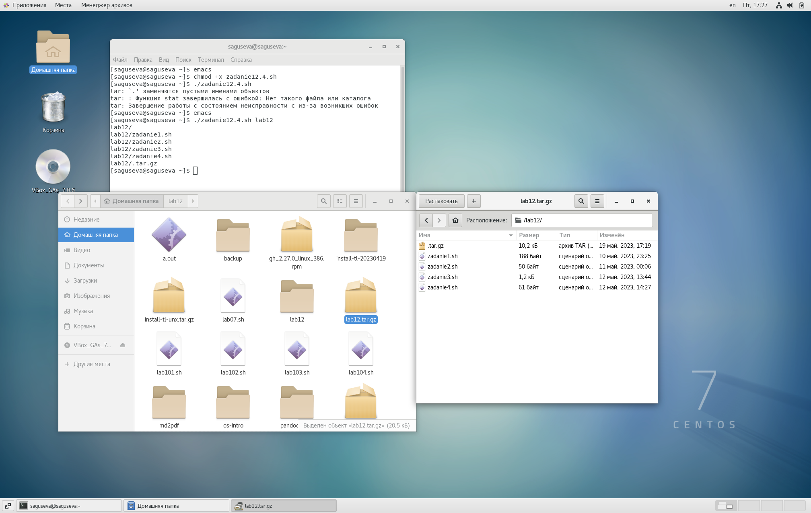

---
## Front matter
title: "Лабораторная работа № 12"
subtitle: "Операционные системы"
author: "Гусева Светлана Алексеевна"

## Generic otions
lang: ru-RU
toc-title: "Содержание"

## Bibliography
bibliography: bib/cite.bib
csl: pandoc/csl/gost-r-7-0-5-2008-numeric.csl

## Pdf output format
toc: true # Table of contents
toc-depth: 2
lof: true # List of figures
lot: true # List of tables
fontsize: 12pt
linestretch: 1.5
papersize: a4
documentclass: scrreprt
## I18n polyglossia
polyglossia-lang:
  name: russian
  options:
	- spelling=modern
	- babelshorthands=true
polyglossia-otherlangs:
  name: english
## I18n babel
babel-lang: russian
babel-otherlangs: english
## Fonts
mainfont: PT Serif
romanfont: PT Serif
sansfont: PT Sans
monofont: PT Mono
mainfontoptions: Ligatures=TeX
romanfontoptions: Ligatures=TeX
sansfontoptions: Ligatures=TeX,Scale=MatchLowercase
monofontoptions: Scale=MatchLowercase,Scale=0.9
## Biblatex
biblatex: true
biblio-style: "gost-numeric"
biblatexoptions:
  - parentracker=true
  - backend=biber
  - hyperref=auto
  - language=auto
  - autolang=other*
  - citestyle=gost-numeric
## Pandoc-crossref LaTeX customization
figureTitle: "Рис."
tableTitle: "Таблица"
listingTitle: "Листинг"
lofTitle: "Список иллюстраций"
lotTitle: "Список таблиц"
lolTitle: "Листинги"
## Misc options
indent: true
header-includes:
  - \usepackage{indentfirst}
  - \usepackage{float} # keep figures where there are in the text
  - \floatplacement{figure}{H} # keep figures where there are in the text
---

# Цель работы

Изучить основы программирования в оболочке ОС UNIX. Научится писать более сложные командные файлы с использованием логических управляющих конструкций и циклов.

# Задание

1. Используя команды getopts grep, написать командный файл, который анализирует командную строку с ключами:
– -iinputfile — прочитать данные из указанного файла;
– -ooutputfile — вывести данные в указанный файл;
– -pшаблон — указать шаблон для поиска;
– -C — различать большие и малые буквы;
– -n — выдавать номера строк.
а затем ищет в указанном файле нужные строки, определяемые ключом -p.
2. Написать на языке Си программу, которая вводит число и определяет, является
ли оно больше нуля, меньше нуля или равно нулю. Затем программа завершается
с помощью функции exit(n), передавая информацию в о коде завершения в
оболочку. Командный файл должен вызывать эту программу и, проанализировав
с помощью команды $?, выдать сообщение о том, какое число было введено.
3. Написать командный файл, создающий указанное число файлов, пронумерованных последовательно от 1 до N (например 1.tmp, 2.tmp, 3.tmp,4.tmp и т.д.).
Число файлов, которые необходимо создать, передаётся в аргументы командной
строки. Этот же командный файл должен уметь удалять все созданные им файлы
(если они существуют).
4. Написать командный файл, который с помощью команды tar запаковывает в
архив все файлы в указанной директории. Модифицировать его так, чтобы запаковывались только те файлы, которые были изменены менее недели тому назад
(использовать команду find).


# Теоретическое введение

Команда getopts осуществляет синтаксический анализ командной строки, выделяя флаги, и используется для объявления переменных. Синтаксис команды следующий:

getopts option-string variable [arg ... ]

Флаги — это опции командной строки, обычно помеченные знаком минус; Например, для команды ls флагом может являться -F. Иногда флаги имеют аргументы, связанные с ними. Программы интерпретируют флаги, соответствующим образом изменяя своё поведение.

Строка опций option-string — это список возможных букв и чисел соответствующего флага. Если ожидается, что некоторый флаг будет сопровождаться некоторым аргументом, то за символом, обозначающим этот флаг, должно следовать
двоеточие. Соответствующей переменной присваивается буква данной опции. Если команда getopts может распознать аргумент, то она возвращает истину. Принято включать getopts в цикл while и анализировать введённые данные с помощью
оператора case.

Предположим, необходимо распознать командную строку следующего формата:

```

testprog -ifile_in.txt -ofile_out.doc -L -t -r

```

Вот как выглядит использование оператора getopts в этом случае:

```

while getopts o:i:Ltr optletter

do case $optletter in

o) oflag=1; oval=$OPTARG;;

i) iflag=1; ival=$OPTARG;;

L) Lflag=1;;

t) tflag=1;;

r) rflag=1;;

*) echo Illegal option $optletter

esac

done

```

Функция getopts включает две специальные переменные среды — OPTARG и
OPTIND. Если ожидается дополнительное значение, то OPTARG устанавливается в
значение этого аргумента (будет равна file_in.txt для опции i и file_out.doc
для опции o). OPTIND является числовым индексом на упомянутый аргумент.
Функция getopts также понимает переменные типа массив, следовательно,
можно использовать её в функции не только для синтаксического анализа аргументов функций, но и для анализа введённых пользователем данных.


# Выполнение лабораторной работы

1. Используя команды getopts grep, написать командный файл, который анализирует командную строку с ключами:
– -iinputfile — прочитать данные из указанного файла;
– -ooutputfile — вывести данные в указанный файл;
– -pшаблон — указать шаблон для поиска;
– -C — различать большие и малые буквы;
– -n — выдавать номера строк.
а затем ищет в указанном файле нужные строки, определяемые ключом -p.
Результат работы командного файла (рис. @fig:001), скрипт командного файла (рис. @fig:002).

{#fig:001 width=70%}

{#fig:002 width=70%}

2. Написать на языке Си программу, которая вводит число и определяет, является
ли оно больше нуля, меньше нуля или равно нулю. Затем программа завершается
с помощью функции exit(n), передавая информацию в о коде завершения в
оболочку. Командный файл должен вызывать эту программу и, проанализировав
с помощью команды $?, выдать сообщение о том, какое число было введено. Проверка установки gcc (рис. @fig:003), результат выполнения (рис. @fig:004), программа на С (рис. @fig:005), командный файл (рис. @fig:006).

{#fig:003 width=70%}

{#fig:004 width=70%}

{#fig:005 width=70%}

{#fig:006 width=70%}

3. Написать командный файл, создающий указанное число файлов, пронумерованных последовательно от 1 до N (например 1.tmp, 2.tmp, 3.tmp,4.tmp и т.д.).
Число файлов, которые необходимо создать, передаётся в аргументы командной
строки. Этот же командный файл должен уметь удалять все созданные им файлы
(если они существуют). Командный файл (рис. @fig:007), результат выполнения задания (рис. @fig:008).

{#fig:007 width=70%}

{#fig:008 width=70%}

4. Написать командный файл, который с помощью команды tar запаковывает в
архив все файлы в указанной директории. Результат выполнения задания (рис. @fig:009), скрипт (рис. @fig:010).

{#fig:009 width=70%}

{#fig:010 width=70%}

Модифицировать его так, чтобы запаковывались только те файлы, которые были изменены менее недели тому назад
(использовать команду find). Результат выполнения задания (рис. @fig:011), скрипт (рис. @fig:012).

{#fig:011 width=70%}

{#fig:012 width=70%}


# Выводы

В ходе выполнения лабораторной работы мной были изучены основы программирования в оболочке ОС UNIX. Я научилась писать более сложные командные файлы с использованием логических управляющих конструкций и циклов.

# Контрольные вопросы

1. Каково предназначение команды getopts?

Команда getopts является встроенной командой командной оболочки bash, предназначенной для разбора параметров сценариев. Она обрабатывает исключительно однобуквенные параметры как с аргументами, так и без них и этого вполне достаточно для передачи сценариям любых входных данных.

2. Какое отношение метасимволы имеют к генерации имён файлов?

После всех подстановок в каждом слове команды ищутся символы *,?, и [. Если находится хотя бы один из них, то это слово рассматривается как шаблон имен файлов и заменяется именами файлов, удовлетворяющих данному шаблону (в алфавитном порядке). Если ни одно имя файла не удовлетворяет шаблону, то он остается неизменным. Значения указанных символов:

*	любая строка, включая и пустую

?	один любой символ

[...]	любой из указанных между ними символов.

Пара символов, разделенных знаком -, означает любой символ, который находится между ними, включая и их самих. Если первым символом после "[" идет "!", то указанные символы не должны входить в имя файла

3. Какие операторы управления действиями вы знаете?

Оператор условия if/else; операторы цикла for, while, until; оператор выбора case; оператор выхода из цикла break; оператор перехода к следующей итерации цикла continue.

4. Какие операторы используются для прерывания цикла?

Break, continue.

5. Для чего нужны команды false и true?

False и true возвращают соответственно 0 и 1. Используются для проверки условий. 
6. Что означает строка if test -f man$s/$i.$s, встреченная в командном файле?

Проверка существования файла с именем man$s/$i.$s, $s и $i - переменные, заданные в командном файле.

7. Объясните различия между конструкциями while и until.

При использовании while код выполняется, пока условие не станет ложным, при использовании until - пока условие не станет истинным. 

# Список литературы{.unnumbered}

::: 
https://linux-faq.ru/page/komanda-getopts

https://www.linuxlib.ru/shell/gl1.htm?ysclid=lhtkde2kyu465851927

:::
