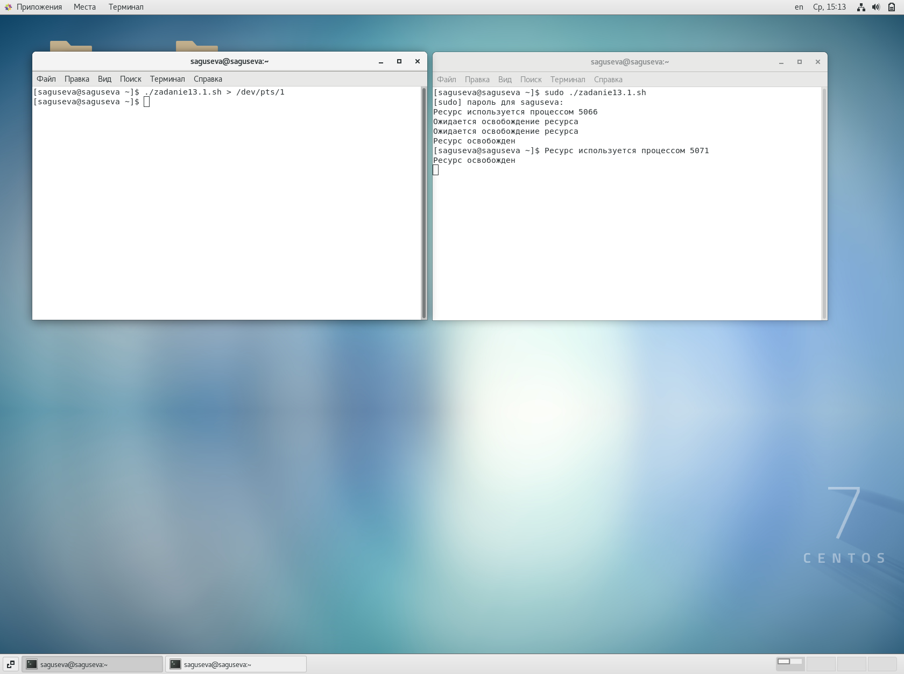
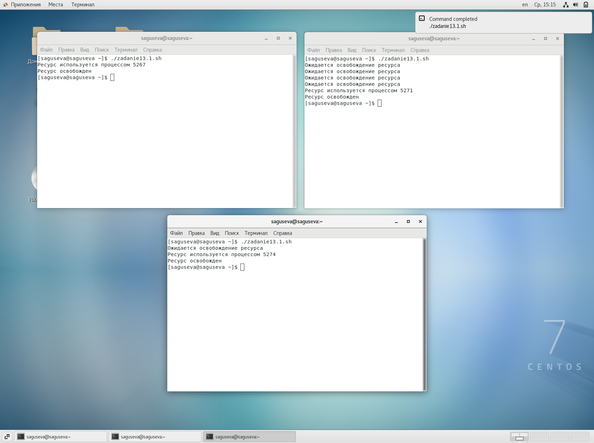
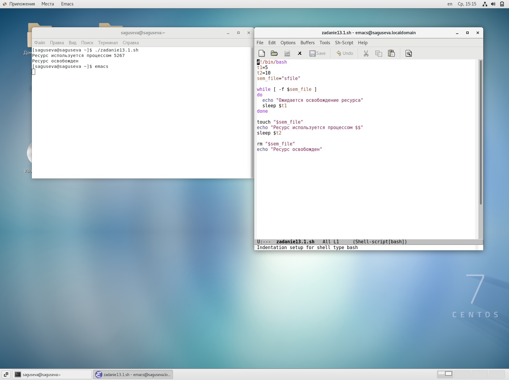
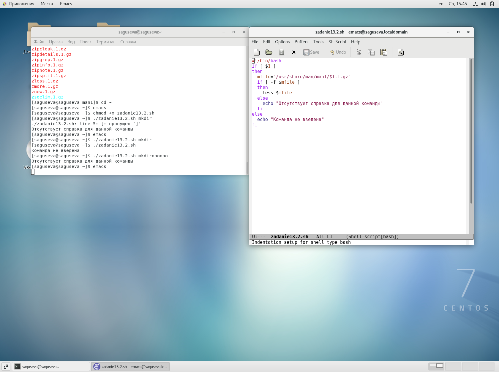
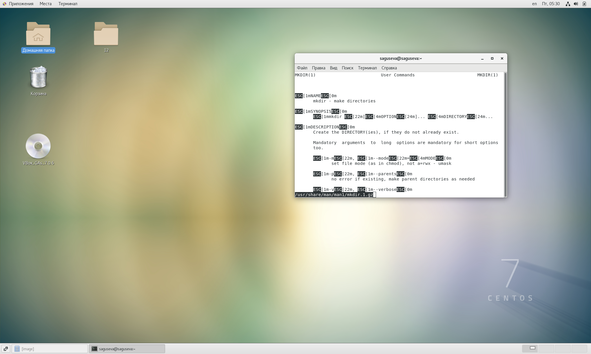

---
## Front matter
title: "Лабораторная работа №13"
subtitle: "Операционные системы"
author: "Гусева Светлана Алексеевна"

## Generic otions
lang: ru-RU
toc-title: "Содержание"

## Bibliography
bibliography: bib/cite.bib
csl: pandoc/csl/gost-r-7-0-5-2008-numeric.csl

## Pdf output format
toc: true # Table of contents
toc-depth: 2
lof: true # List of figures
lot: true # List of tables
fontsize: 12pt
linestretch: 1.5
papersize: a4
documentclass: scrreprt
## I18n polyglossia
polyglossia-lang:
  name: russian
  options:
	- spelling=modern
	- babelshorthands=true
polyglossia-otherlangs:
  name: english
## I18n babel
babel-lang: russian
babel-otherlangs: english
## Fonts
mainfont: PT Serif
romanfont: PT Serif
sansfont: PT Sans
monofont: PT Mono
mainfontoptions: Ligatures=TeX
romanfontoptions: Ligatures=TeX
sansfontoptions: Ligatures=TeX,Scale=MatchLowercase
monofontoptions: Scale=MatchLowercase,Scale=0.9
## Biblatex
biblatex: true
biblio-style: "gost-numeric"
biblatexoptions:
  - parentracker=true
  - backend=biber
  - hyperref=auto
  - language=auto
  - autolang=other*
  - citestyle=gost-numeric
## Pandoc-crossref LaTeX customization
figureTitle: "Рис."
tableTitle: "Таблица"
listingTitle: "Листинг"
lofTitle: "Список иллюстраций"
lotTitle: "Список таблиц"
lolTitle: "Листинги"
## Misc options
indent: true
header-includes:
  - \usepackage{indentfirst}
  - \usepackage{float} # keep figures where there are in the text
  - \floatplacement{figure}{H} # keep figures where there are in the text
---

# Цель работы

Изучить основы программирования в оболочке ОС UNIX. Научиться писать более сложные командные файлы с использованием логических управляющих конструкций и циклов.

# Задание

1. Написать командный файл, реализующий упрощённый механизм семафоров. Командный файл должен в течение некоторого времени t1 дожидаться освобождения ресурса, выдавая об этом сообщение, а дождавшись его освобождения, использовать его в течение некоторого времени t2<>t1, также выдавая информацию о том, что ресурс используется соответствующим командным файлом (процессом). Запустить командный файл в одном виртуальном терминале в фоновом режиме, перенаправив его вывод в другой (> /dev/tty#, где # — номер терминала куда перенаправляется вывод), в котором также запущен этот файл, но не фоновом, а в привилегированном режиме. Доработать программу так, чтобы имелась возможность взаимодействия трёх и более процессов.

2. Реализовать команду man с помощью командного файла. Изучите содержимое
каталога /usr/share/man/man1. В нем находятся архивы текстовых файлов,
содержащих справку по большинству установленных в системе программ и команд. Каждый архив можно открыть командой less сразу же просмотрев содержимое справки. Командный файл должен получать в виде аргумента командной строки название команды и в виде результата выдавать справку об этой команде или сообщение об отсутствии справки, если соответствующего файла нет в
каталоге man1.

3. Используя встроенную переменную $RANDOM, напишите командный файл, генерирующий случайную последовательность букв латинского алфавита. Учтите,
что $RANDOM выдаёт псевдослучайные числа в диапазоне от 0 до 32767.

# Выполнение лабораторной работы

1. Написать командный файл, реализующий упрощённый механизм семафоров. Командный файл должен в течение некоторого времени t1 дожидаться освобождения ресурса, выдавая об этом сообщение, а дождавшись его освобождения, использовать его в течение некоторого времени t2<>t1, также выдавая информацию о том, что ресурс используется соответствующим командным файлом (процессом). Запустить командный файл в одном виртуальном терминале в фоновом режиме, перенаправив его вывод в другой (> /dev/tty#, где # — номер терминала куда перенаправляется вывод), в котором также запущен этот файл, но не фоновом, а в привилегированном режиме. Доработать программу так, чтобы имелась возможность взаимодействия трёх и более процессов.

Пока существует файл с названием sem_file, ожидается освобождение ресурса. Затем ресурс используется в течение времени t2 (создается файл sem_file, происходит ожидание в течение t2 секунд, после чего sem_file удаляется). Результат выполнения задания 1 в двух терминалах (рис. @fig:001), результат выполнения задания 1 в трех терминалах (рис. @fig:002), скрипт задания 1 (рис. @fig:003).

{#fig:001 width=70%}

{#fig:002 width=70%}

{#fig:003 width=70%}

2. Реализовать команду man с помощью командного файла. Изучите содержимое
каталога /usr/share/man/man1. В нем находятся архивы текстовых файлов,
содержащих справку по большинству установленных в системе программ и команд. Каждый архив можно открыть командой less сразу же просмотрев содержимое справки. Командный файл должен получать в виде аргумента командной строки название команды и в виде результата выдавать справку об этой команде или сообщение об отсутствии справки, если соответствующего файла нет в
каталоге man1.

Если задан параметр и существует архив с данным названием, то выводится справка. Если параметр не задан или архива не существует, выводится сообщение об ошибке (рис. @fig:004, рис. @fig:005).

{#fig:004 width=70%}

{#fig:005 width=70%}

3. Используя встроенную переменную $RANDOM, напишите командный файл, генерирующий случайную последовательность букв латинского алфавита. Учтите,
что $RANDOM выдаёт псевдослучайные числа в диапазоне от 0 до 32767.

Сначала с помощью $RANDOM определяется число l, в моей программе оно меньше 50, чтобы последовательность символов не была слишком длинной. Далее в цикле от 0 до l с помощью $RANDOM определяется число num, принадлежащее интервалу от 65 до 122 (эти числа соответствуют латинским буквам и некоторым знакам, номера знаков от 91 до 96). Если числу num соответствует буква, то оно добавляется в последовательность, если соответствует символ, то это число не включается в последовательность. Программа (рис. @fig:006) и результат выполнения (рис. @fig:007).

{#fig:004 width=70%}

{#fig:005 width=70%}

# Выводы

В процессе выполнения лабораторной работы мной были изучены основы программирования в оболочке ОС UNIX. Я научилась писать более сложные командные файлы с использованием логических управляющих конструкций и циклов.

# Контрольные вопросы

1. Найдите синтаксическую ошибку в следующей строке:

while [$1 != "exit"]

Без ошибки: while (( $1 != "exit" )) или while [ $1 -ne "exit" ]

2. Как объединить (конкатенация) несколько строк в одну?

s1="Hello,"

s2=" World"

s3="$s1$s2"

3. Найдите информацию об утилите seq. Какими иными способами можно реализовать её функционал при программировании на bash?

seq — утилита, используемая в unix-системах для генерации последовательности. В самом простом варианте использования — seq N — выводит на печать все целые числа от 1 до N в последовательности. Для получения последовательности целых чисел вместо seq можно использовать цикл for.

4. Какой результат даст вычисление выражения $((10/3))?

3

5. Укажите кратко основные отличия командной оболочки zsh от bash.

У Zsh есть поддержка с плавающей точкой, которой нет у Bash.

В Zsh поддерживаются структуры хеш-данных, которых нет в Bash.

Функции вызова в Bash лучше по сравнению с Zsh.

Внешний вид подсказки можно контролировать в Bash, тогда как Zsh настраивается.

Конфигурационными файлами являются .bashrc в интерактивных оболочках без регистрации и .profile или .bash_profile в оболочках входа в Bash. В Zsh оболочками, не входящими в систему, являются .zshrc, а оболочками для входа - .zprofile.

Массивы Zsh индексируются от 1 до длины, тогда как Bash индексируется от -1 до длины.

В Zsh, если шаблоны не совпадают ни с одним файлом, выдается ошибка. Находясь в Баше, он остается без изменений.

Правая часть конвейера запускается как родительская оболочка в Zsh, в то время как в Bash она запускается как подоболочка.

В Zsh функция zmv используется для массового переименования, тогда как в Bash мы должны использовать функцию расширения параметров.

Bash имеет хорошие возможности написания сценариев в одной строке, в то время как в Zsh мы не смогли найти то же самое.

По умолчанию выходные данные хранятся во временном файле в Zsh, а в Bash - нет.

Многие встроенные функции в Bash упрощают сложные программы, тогда как в Zsh встроенных функций для сложных программ меньше.

Zsh эффективно управляет своими файлами, в то время как Bash плохо умеет работать с файлами.

6. Проверьте, верен ли синтаксис данной конструкции

for ((a=1; a <= LIMIT; a++))

Верен. До цикла переменной LIMIT должно быть присвоено значение.

7. Сравните язык bash с какими-либо языками программирования. Какие преимущества у bash по сравнению с ними? Какие недостатки?

Проведу сравнение bash и python. Bash предназначен для Linux и macOS для автоматизации задач. Он подходит для простых и небольших скриптов. Python предназначен для разработки веб-приложений и приложений. Он подходит для больших программ. Python проще в использовании, его синтаксис интуитивно понятнее. Программы, написанные на языке Python, можно запускать на любой платформе, скрипты на Bash можно запускать только на Linux'е. Bash был разработан для системных администраторов для выполнения автоматизированных задач. И наоборот, Python был создан для программистов для разработки веб-сайтов и приложений. Следовательно, оба языка программирования были созданы для разных целей. 

# Список литературы{.unnumbered}

::: {#refs}
:::
