---
## Front matter
title: "Лабораторная работа № 14"
subtitle: "Операционные системы"
author: "Гусева Светлана Алексеевна"

## Generic otions
lang: ru-RU
toc-title: "Содержание"

## Bibliography
bibliography: bib/cite.bib
csl: pandoc/csl/gost-r-7-0-5-2008-numeric.csl

## Pdf output format
toc: true # Table of contents
toc-depth: 2
lof: true # List of figures
lot: true # List of tables
fontsize: 12pt
linestretch: 1.5
papersize: a4
documentclass: scrreprt
## I18n polyglossia
polyglossia-lang:
  name: russian
  options:
	- spelling=modern
	- babelshorthands=true
polyglossia-otherlangs:
  name: english
## I18n babel
babel-lang: russian
babel-otherlangs: english
## Fonts
mainfont: PT Serif
romanfont: PT Serif
sansfont: PT Sans
monofont: PT Mono
mainfontoptions: Ligatures=TeX
romanfontoptions: Ligatures=TeX
sansfontoptions: Ligatures=TeX,Scale=MatchLowercase
monofontoptions: Scale=MatchLowercase,Scale=0.9
## Biblatex
biblatex: true
biblio-style: "gost-numeric"
biblatexoptions:
  - parentracker=true
  - backend=biber
  - hyperref=auto
  - language=auto
  - autolang=other*
  - citestyle=gost-numeric
## Pandoc-crossref LaTeX customization
figureTitle: "Рис."
tableTitle: "Таблица"
listingTitle: "Листинг"
lofTitle: "Список иллюстраций"
lotTitle: "Список таблиц"
lolTitle: "Листинги"
## Misc options
indent: true
header-includes:
  - \usepackage{indentfirst}
  - \usepackage{float} # keep figures where there are in the text
  - \floatplacement{figure}{H} # keep figures where there are in the text
---

# Цель работы

Приобрести простейшие навыки разработки, анализа, тестирования и отладки
приложений в ОС типа UNIX/Linux на примере создания на языке программирования С калькулятора с простейшими функциями.

# Задание

1. В домашнем каталоге создайте подкаталог ~/work/os/lab_prog.

2. Создайте в нём файлы: calculate.h, calculate.c, main.c.
Это будет примитивнейший калькулятор, способный складывать, вычитать,
умножать и делить, возводить число в степень, брать квадратный корень, вычислять sin, cos, tan. При запуске он будет запрашивать первое число, операцию,
второе число. После этого программа выведет результат и остановится.

Реализация функций калькулятора в файле calculate.h:

```
////////////////////////////////////
// calculate.c
#include <stdio.h>
#include <math.h>
#include <string.h>
#include "calculate.h"
float
Calculate(float Numeral, char Operation[4])
{
float SecondNumeral;
if(strncmp(Operation, "+", 1) == 0)
{
printf("Второе слагаемое: ");
scanf("%f",&SecondNumeral);
return(Numeral + SecondNumeral);
}
else if(strncmp(Operation, "-", 1) == 0)
{
printf("Вычитаемое: ");
scanf("%f",&SecondNumeral);
return(Numeral - SecondNumeral);
}
else if(strncmp(Operation, "*", 1) == 0)
{
printf("Множитель: ");
scanf("%f",&SecondNumeral);
return(Numeral * SecondNumeral);
}
else if(strncmp(Operation, "/", 1) == 0)
{
printf("Делитель: ");
scanf("%f",&SecondNumeral);
if(SecondNumeral == 0)
{
printf("Ошибка: деление на ноль! ");
return(HUGE_VAL);
}
else
return(Numeral / SecondNumeral);
}
else if(strncmp(Operation, "pow", 3) == 0)
{
printf("Степень: ");
scanf("%f",&SecondNumeral);
return(pow(Numeral, SecondNumeral));
}
else if(strncmp(Operation, "sqrt", 4) == 0)
return(sqrt(Numeral));
else if(strncmp(Operation, "sin", 3) == 0)
return(sin(Numeral));
else if(strncmp(Operation, "cos", 3) == 0)
return(cos(Numeral));
else if(strncmp(Operation, "tan", 3) == 0)
return(tan(Numeral));
else
{
printf("Неправильно введено действие ");
return(HUGE_VAL);
}
}
```
Интерфейсный файл calculate.h, описывающий формат вызова функции калькулятора:

```

///////////////////////////////////////
// calculate.h
#ifndef CALCULATE_H_
#define CALCULATE_H_
float Calculate(float Numeral, char Operation[4]);
#endif /*CALCULATE_H_*/
Основной файл main.c, реализующий интерфейс пользователя к калькулятору:
////////////////////////////////////////
// main.c
#include <stdio.h>
#include "calculate.h"
int
main (void)
{
float Numeral;
char Operation[4];
float Result;
printf("Число: ");
scanf("%f",&Numeral);
printf("Операция (+,-,*,/,pow,sqrt,sin,cos,tan): ");
scanf("%s",&Operation);
Result = Calculate(Numeral, Operation);
printf("%6.2f\n",Result);
return 0;
}
```
3. Выполните компиляцию программы посредством gcc:
```
gcc -c calculate.c
gcc -c main.c
gcc calculate.o main.o -o calcul -lm
```

4. При необходимости исправьте синтаксические ошибки.

5. Создайте Makefile со следующим содержанием:

```
#
# Makefile
#
CC = gcc
CFLAGS =
LIBS = -lm
calcul: calculate.o main.o
gcc calculate.o main.o -o calcul $(LIBS)
calculate.o: calculate.c calculate.h
gcc -c calculate.c $(CFLAGS)
main.o: main.c calculate.h
gcc -c main.c $(CFLAGS)
clean:
-rm calcul *.o *~
# End Makefile
```
Поясните в отчёте его содержание.
6. С помощью gdb выполните отладку программы calcul (перед использованием
gdb исправьте Makefile):

– Запустите отладчик GDB, загрузив в него программу для отладки:
gdb ./calcul

– Для запуска программы внутри отладчика введите команду run:
run

– Для постраничного (по 9 строк) просмотра исходного код используйте команду list:
list

– Для просмотра строк с 12 по 15 основного файла используйте list с параметрами:
list 12,15

– Для просмотра определённых строк не основного файла используйте list
с параметрами:
list calculate.c:20,29

– Установите точку останова в файле calculate.c на строке номер 21:
list calculate.c:20,27
break 21

– Выведите информацию об имеющихся в проекте точка останова:
info breakpoints

– Запустите программу внутри отладчика и убедитесь, что программа остановится в момент прохождения точки останова:

run

5

-

backtrace

– Отладчик выдаст следующую информацию:

#0 Calculate (Numeral=5, Operation=0x7fffffffd280 "-")

at calculate.c:21

#1 0x0000000000400b2b in main () at main.c:17

а команда backtrace покажет весь стек вызываемых функций от начала
программы до текущего места.

– Посмотрите, чему равно на этом этапе значение переменной Numeral, введя:
print Numeral

На экран должно быть выведено число 5.

– Сравните с результатом вывода на экран после использования команды:
display Numeral

– Уберите точки останова:

info breakpoints

delete 1

7. С помощью утилиты splint попробуйте проанализировать коды файлов
calculate.c и main.c.

# Выполнение лабораторной работы

В домашнем каталоге создан подкаталог ~/work/os/lab_prog и файлы calculate.h, calculate.c, main.c. (рис. @fig:001, рис. @fig:002, рис. @fig:003, рис. @fig:004, рис. @fig:005).

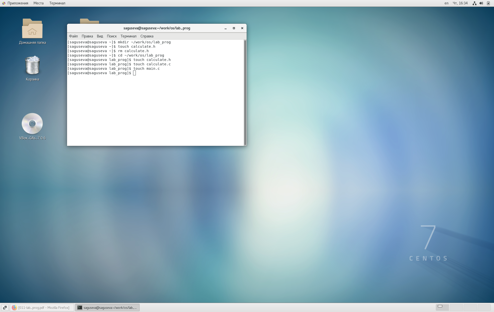{#fig:001 width=70%}

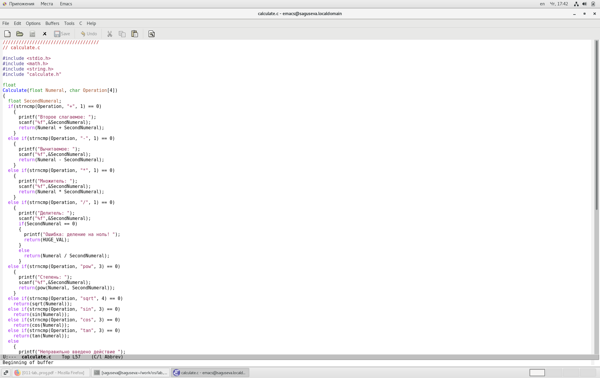{#fig:002 width=70%}

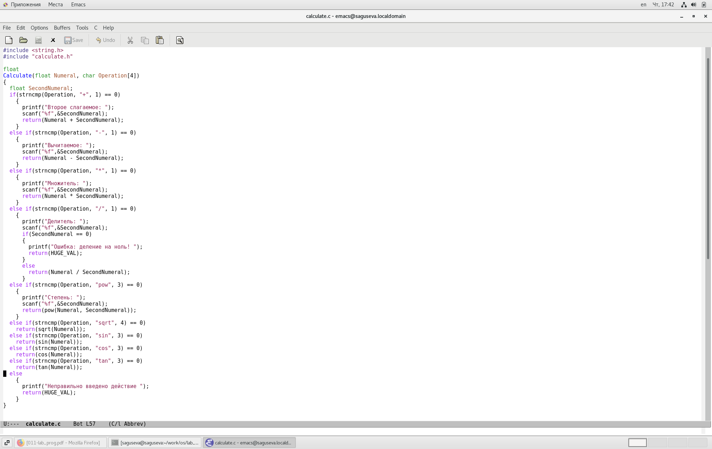{#fig:003 width=70%}

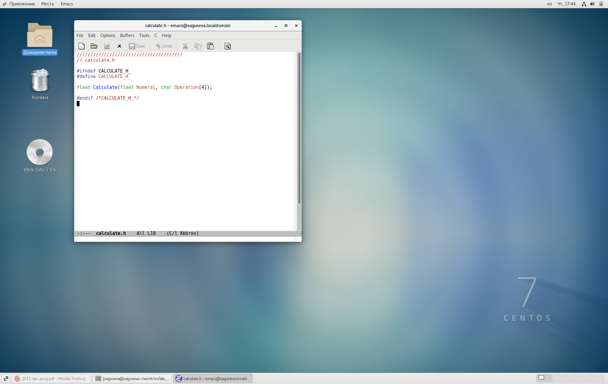{#fig:004 width=70%}

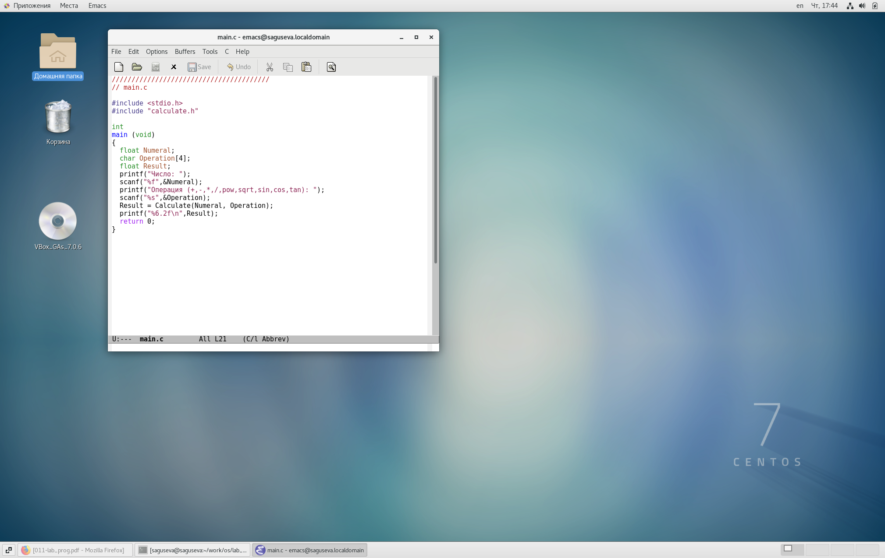{#fig:005 width=70%}

Выполнение компиляции программы посредством gcc (рис. @fig:006).

{#fig:006 width=70%}

Создание Makefile и исправление ошибок (рис. @fig:007).

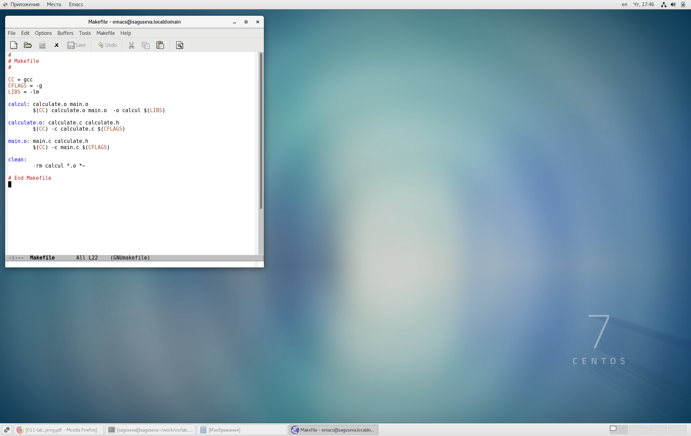{#fig:007 width=70%}

Комментарии к Makefile:

```
CC = gcc #компилятор
CFLAGS = -g #опция gcc для создания отладочной информации
LIBS = -lm
#Создание файла calcul
calcul: calculate.o main.o
	$(CC) calculate.o main.o -o calcul $(LIBS) #gcc calculate.o main.o -o calcul -lm
#Создание файла calculate.o
calculate.o: calculate.c calculate.h #
	$(CC) -c calculate.c $(CFLAGS) #gcc -c calculate.c -g
#Создание файла main.o
main.o: main.c calculate.h
	$(CC) -c main.c $(CFLAGS) #gcc -c main.c -g
#
clean: #удаление всех файлов с разрешением .о
	-rm calcul *.o *~ #
```

Запуск отладчика GDB и загрузка в него программы для отладки (рис. @fig:008).

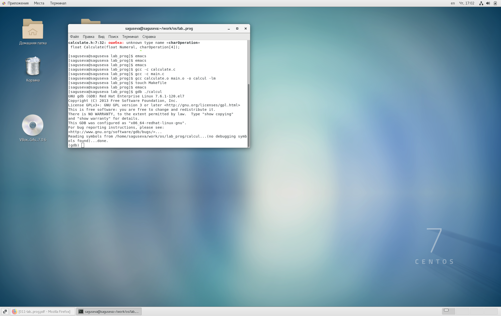{#fig:008 width=70%}

Для запуска программы внутри отладчика была введена команда run (рис. @fig:009).

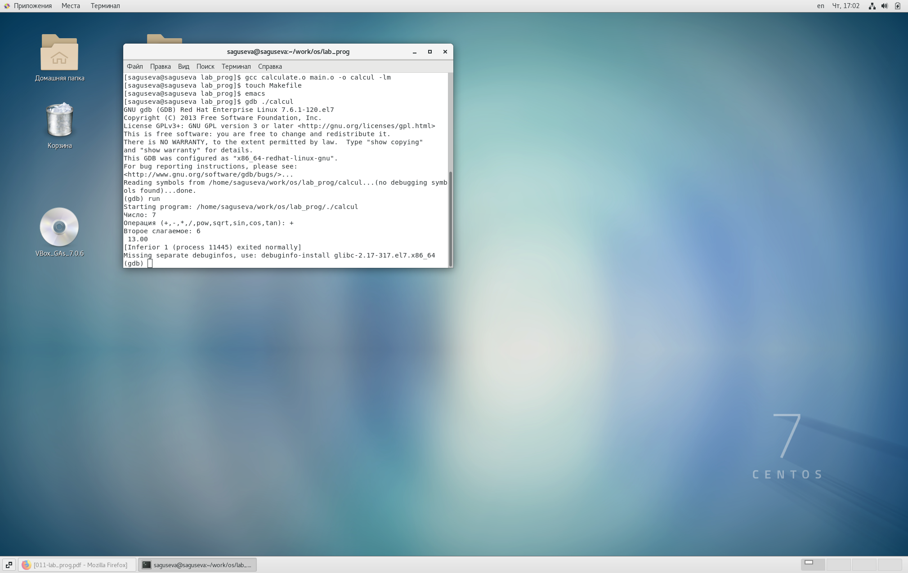{#fig:009 width=70%}

Выполнение make и make clean (рис. @fig:010).

{#fig:010 width=70%}

Для постраничного (по 9 строк) просмотра исходного код была использована команда list (рис. @fig:011).

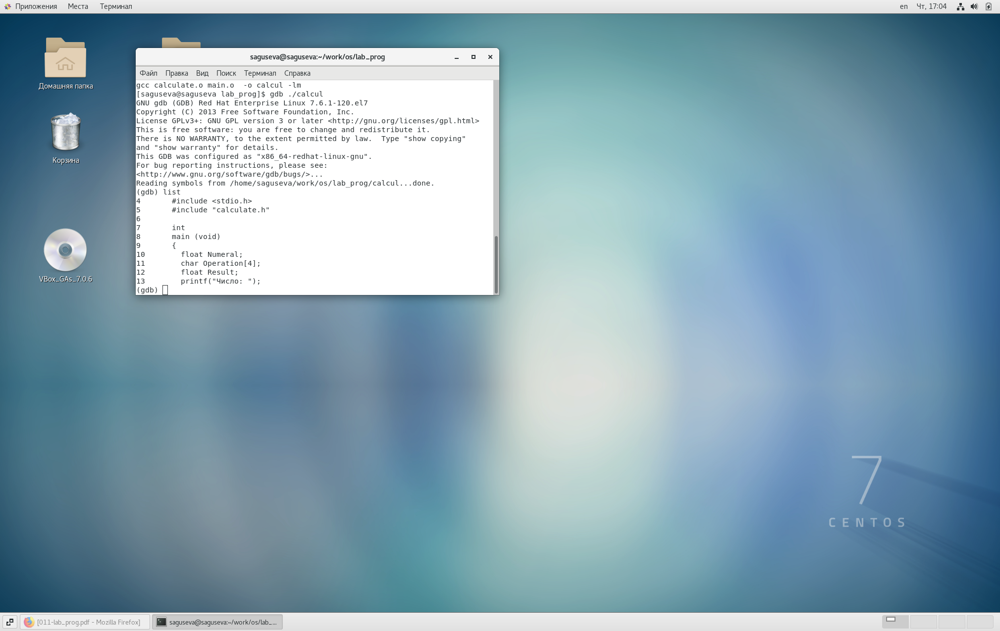{#fig:011 width=70%}

Для просмотра строк с 12 по 15 основного файла была использована команда list с параметрами 12,15 (рис. @fig:012).

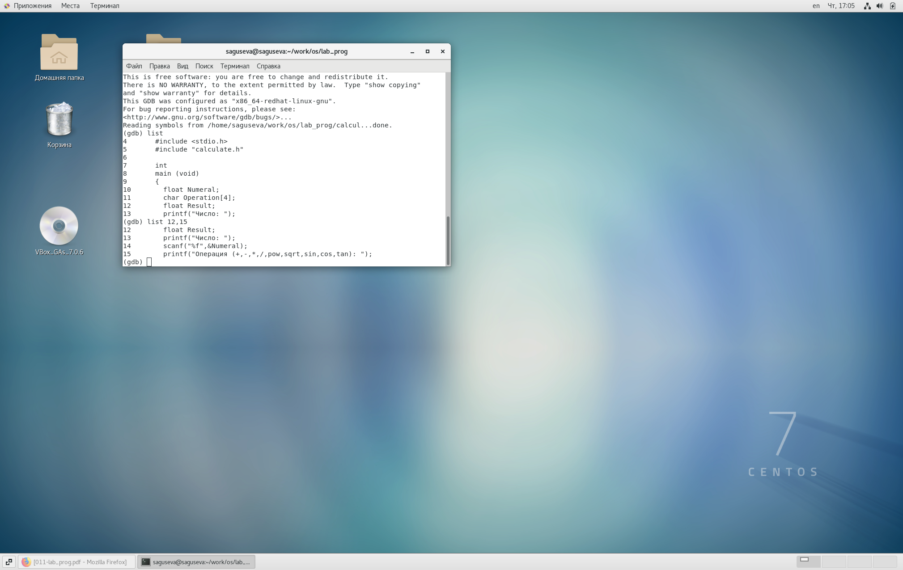{#fig:012 width=70%}

Для просмотра определённых строк не основного файла была использована команда list с параметрами calculate.c:20,29 (рис. @fig:013).

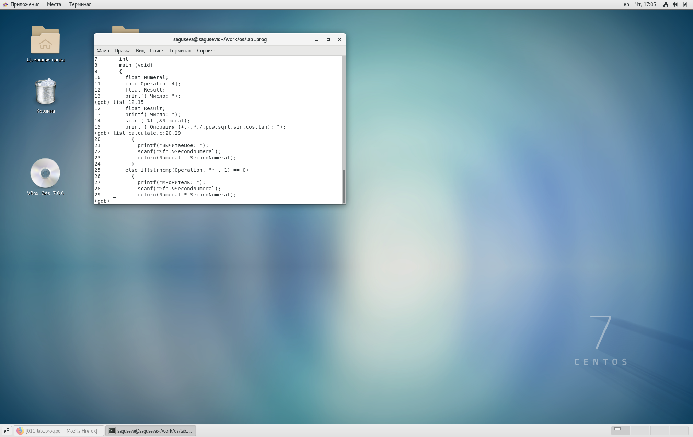{#fig:013 width=70%}

Была установлена точка останова в файле calculate.c на строке номер 21 (рис. @fig:014).

{#fig:014 width=70%}

Выведение информации об имеющихся в проекте точках останова (рис. @fig:015).

{#fig:015 width=70%}

Была запущена программа внутри отладчика. Программа остановилась в момент прохождения точки останова (рис. @fig:016).

{#fig:016 width=70%}

Просмотр значения переменной Numeral на этом этапе (рис. @fig:017).

{#fig:017 width=70%}

Результат выполнения команды display Numeral (рис. @fig:018).

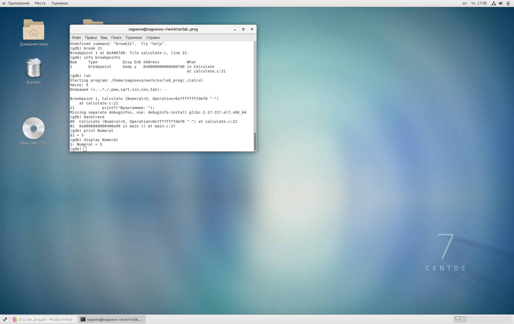{#fig:018 width=70%}

Удаление точки останова (рис. @fig:019).

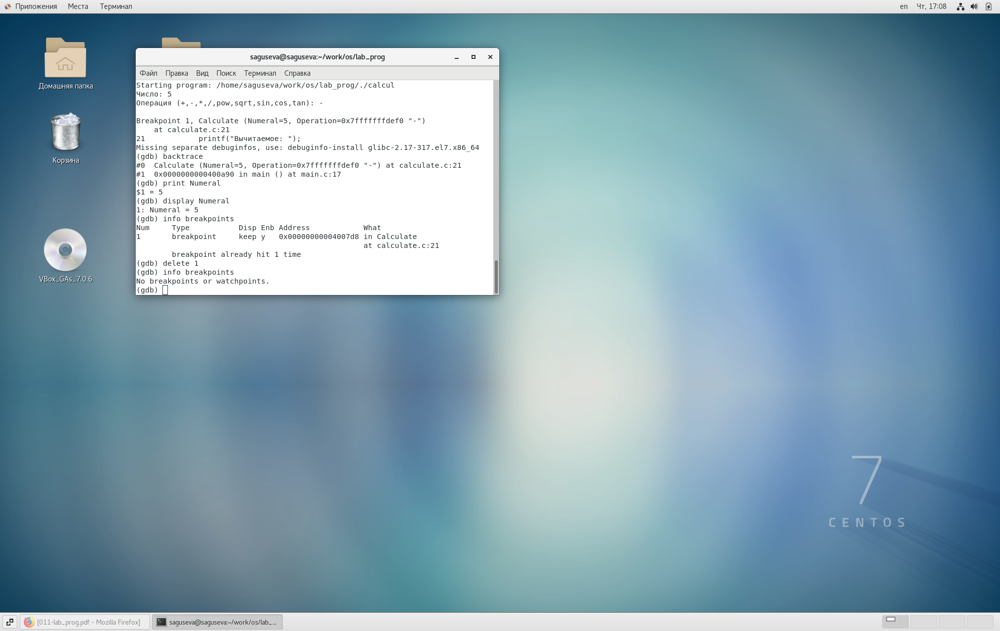{#fig:019 width=70%}

Установка утилиты splint (рис. @fig:020).

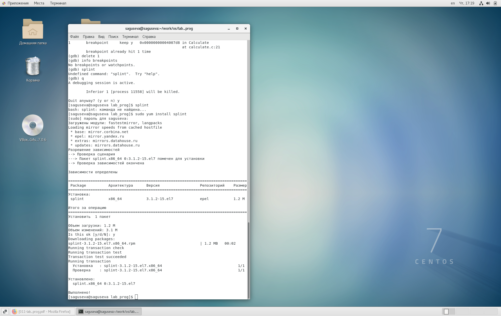{#fig:020 width=70%}

Анализ кода файла calculate.c с помощью утилиты split (рис. @fig:021).

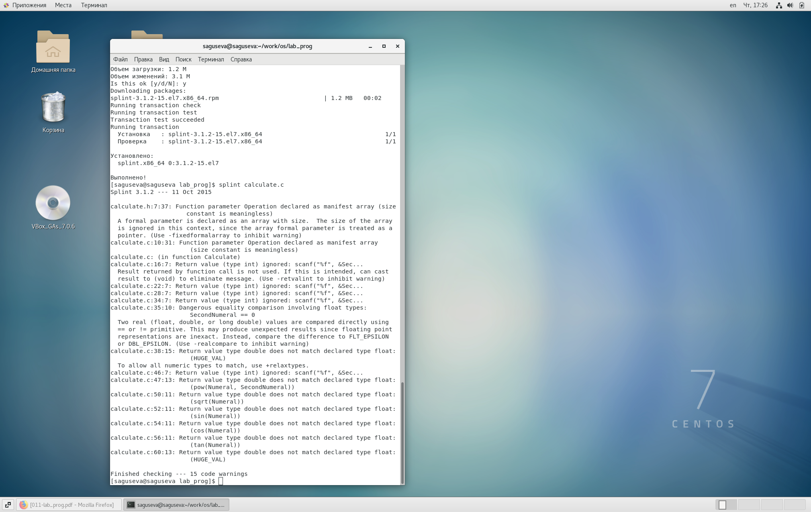{#fig:021 width=70%}

Анализ кода файла main.c с помощью утилиты split (рис. @fig:022).

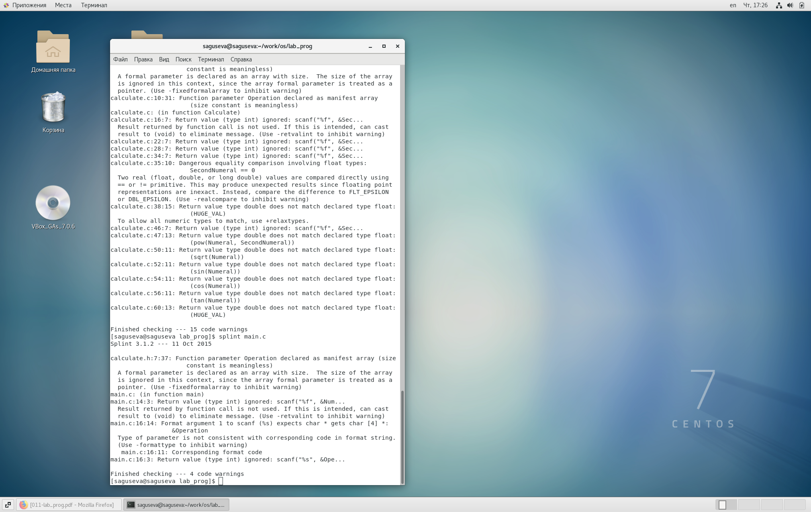{#fig:022 width=70%}

# Выводы

В процессе выполнения лабораторной работы мной были преобретены простейшие навыки разработки, анализа, тестирования и отладки приложений в ОС типа UNIX/Linux на примере создания на языке программирования С калькулятора с простейшими функциями.

# Контрольные вопросы

1. Как получить информацию о возможностях программ gcc, make, gdb и др.?

С помощью команд man и info.

2. Назовите и дайте краткую характеристику основным этапам разработки приложений в UNIX.

-создание исходного кода программы;

-представляется в виде файла

-сохранение различных вариантов исходного текста;

-анализ исходного текста;

-компиляция исходного текста и построение исполняемого модуля;

-тестирование и отладка; 

-проверка кода на наличие ошибок

-сохранение всех изменений, выполняемых при тестировании и отладке.

3. Что такое суффикс в контексте языка программирования? Приведите примеры
использования.

Суффикс - это составная часть имени файла. Например, в имени файла calculate.c, ".c" - это суффикс.

4. Каково основное назначение компилятора языка С в UNIX?

Основное назначение компилятора с языка Си заключается в компиляции всей программы в целом и получении исполняемого модуля.

5. Для чего предназначена утилита make?

Для автоматизации преобразования файлов из одной формы в другую. 

6. Приведите пример структуры Makefile. Дайте характеристику основным элементам этого файла.

```
CC = gcc #компилятор
CFLAGS = -g #опция gcc для создания отладочной информации
LIBS = -lm
#Создание файла calcul
calcul: calculate.o main.o
	$(CC) calculate.o main.o -o calcul $(LIBS) #gcc calculate.o main.o -o calcul -lm
#Создание файла calculate.o
calculate.o: calculate.c calculate.h #
	$(CC) -c calculate.c $(CFLAGS) #gcc -c calculate.c -g
#Создание файла main.o
main.o: main.c calculate.h
	$(CC) -c main.c $(CFLAGS) #gcc -c main.c -g
#
clean: #удаление всех файлов с разрешением .о
	-rm calcul *.o *~ #
```

7. Назовите основное свойство, присущее всем программам отладки. Что необходимо сделать, чтобы его можно было использовать?

Для отладки программ обычно применяют три способа:

1. Пошаговая отладка программ с заходом в подпрограммы;

2. Пошаговая отладка программ с выполнением подпрограммы как одного оператора;

3. Выполнение программы до точки останова.

Пошаговая отладка программ заключается в том, что выполняется один оператор программы и, затем контролируются те переменные, на которые должен был воздействовать данный оператор.

Если в программе имеются уже отлаженные подпрограммы, то подпрограмму можно рассматривать, как один оператор программы и воспользоваться вторым способом отладки программ.

Если в программе существует достаточно большой участок программы, уже отлаженный ранее, то его можно выполнить, не контролируя переменные, на которые он воздействует. Использование точек останова позволяет пропускать уже отлаженную часть программы. Точка останова устанавливается в местах, где необходимо проверить содержимое переменных или просто проконтролировать, передаётся ли управление данному оператору.

Практически во всех отладчиках поддерживается это свойство (а также выполнение программы до курсора и выход из подпрограммы). Затем отладка программы продолжается в пошаговом режиме с контролем локальных и глобальных переменных, а также внутренних регистров микроконтроллера и напряжений на выводах этой микросхемы.

Следует отметить такое достоинство программы, как то, что она сразу показывает, где именно допущена та или иная ошибка, выделяя строку.

8. Назовите и дайте основную характеристику основным командам отладчика gdb.

break или b - создание точки останова;

info или i - вывести информацию, доступные значения: break, registers, frame, locals, args;

run или r - запустить программу;

continue или c - продолжить выполнение программы после точки останова;

step или s - выполнить следующую строчку программы с заходом в функцию;

next или n - выполнить следующую строчку без захода в функцию;

print или p - вывести значение переменной;

backtrace или bt - вывести стек вызовов;

x - просмотр содержимого памяти по адресу;

ptype - просмотр типа переменной;

h или help - просмотр справки по команде;

q или quit - выход из программы.

9. Опишите по шагам схему отладки программы, которую Вы использовали при
выполнении лабораторной работы.

1) компиляция программы;

2) исправление ошибок в программе;

3) загрузка программы в gdb;

4) выполнение программы отладчиком.

10. Прокомментируйте реакцию компилятора на синтаксические ошибки в программе при его первом запуске.

Ошибки отсутствуют.

11. Назовите основные средства, повышающие понимание исходного кода программы.

– cscope - исследование функций, содержащихся в программе;

– splint — критическая проверка программ, написанных на языке Си.

12. Каковы основные задачи, решаемые программой splint.

1) Проверка корректности задания аргументов всех использованных в программе функций, а также типов возвращаемых ими значений;

2) Поиск фрагментов исходного текста, корректных с точки зрения синтаксиса языка Си, но малоэффективных с точки зрения их реализации или содержащих в себе семантические ошибки;

3) Общая оценка мобильности пользовательской программы.